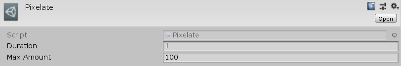

[#manual/pixelate-transition]

## Pixelate Transition

Pixelate Transition is a <<manual/transition.html,Transition>> that will gradually pixelate the screen over the duration of the <<manual/transition.html,Transition>>. Create a Pixelate through the menu:Create[PiRho Soft > Transitions > Pixelate] menu in the project view.

### Fields

[cols="1,2"]
|===
| Name	| Description

| Max Amount	| The maximum amount of pixelation
|===

ifdef::backend-multipage_html5[]
<<reference/pixelate-transition.html,Reference>>
endif::[]