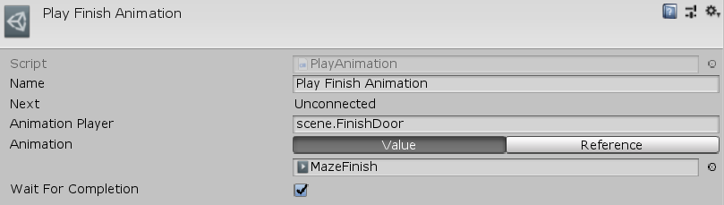

[#manual/play-animation-node]

## Play Animation Node

Play Animation Node is an <<manual/instruction-graph-node.html,Instruction Graph Node>> that tells an <<manual/animation-player.html,Animation Player>> to play an https://docs.unity3d.com/ScriptReference/AnimationClip.html[AnimationClip^]. Create a Play Animation Node in the menu:Create[Animation > Play Animation] menu of the Instruction Graph Window.

See <<topics/graphs-1.html,Graphs>> for more information on instruction graphs. +
See the _"Play Finish Animation"_ node on the _"MazeJewel"_ <<manual/instruction-graph.html,Instruction Graph>> of the Maze project for an example usage.

### Fields

[cols="1,2"]
|===
| Name	| Description

| Animation Player	| A <<reference/variable-reference.html,VariableReference>> to the <<manual/animation-player.html,Animation Player>> to play the clip on
| Animation	| The <<reference/animation-clip-variable-source.html,AnimationClipSource>> of the https://docs.unity3d.com/ScriptReference/AnimationClip.html[AnimationClip^] to play
| Wait For Completion	| Whether to wait for _Animation_ to finish playing before moving on to the next node
|===

ifdef::backend-multipage_html5[]
<<reference/play-animation-node.html,Reference>>
endif::[]