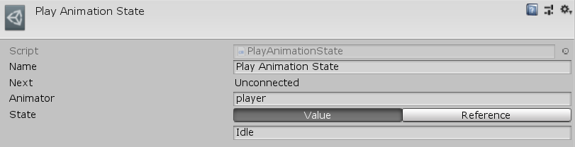

[#manual/play-animation-state]

## Play Animation State

Play Animation State Node is an <<manual/instruction-graph-node.html,Instruction Graph Node>> that tells an https://docs.unity3d.com/ScriptReference/Animator.html[Animator^] to https://docs.unity3d.com/ScriptReference/Animator.Play.html[Play()^] a state. Create a Play Animation State Node in the menu:Create[Animation > Play Animation State] menu of the Instruction Graph Window.

### Fields

[cols="1,2"]
|===
| Name	| Description

| Animator	| A <<reference/variable-reference.html,VariableReference>> to the https://docs.unity3d.com/ScriptReference/Animator.html[Animator^] to play the state on
| State	| A <<reference/string-variable-source.html,StringVariableSource>> to the name of the state to play
|===

ifdef::backend-multipage_html5[]
<<reference/play-animation-state.html,Reference>>
endif::[]