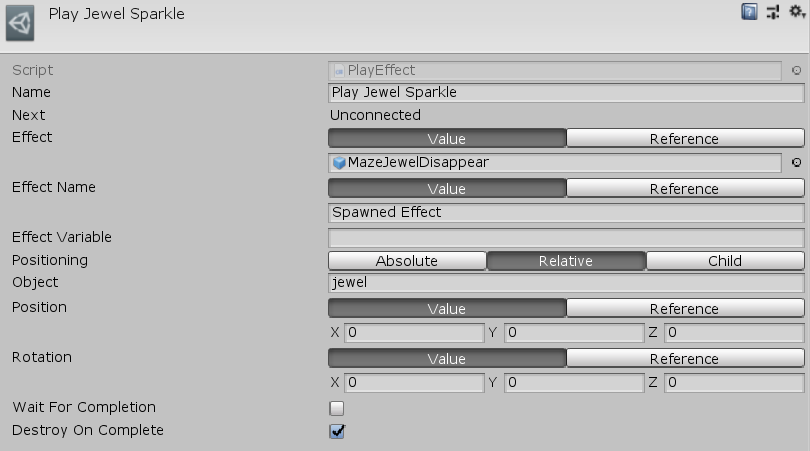

[#manual/play-effect]

## Play Effect

A Play Effect Node is an <<manual/instruction-graph-node.html,Instruction Graph Node>> that will spawn a prefab at the given Name, Position, and Rotation relative to the world, another object, or as a child object. The created effect can optionally be stored in a given <<reference/variable-reference.html,VariableReference>> so that it can be accessed later. This differs from a standard <<manual/create-game-object-node.html,Create Game Object Node>> in that a Play Effect Node can _WaitForCompletion_ of the effect and destroy it when it is finished. The created effect object is queried for https://docs.unity3d.com/ScriptReference/ParticleSystem.html[ParticleSystems^] and other components that implement <<reference/i-completion-notifier.html,ICompletionNotifier>> to determine when the effect is finished. Create a Play Effect Node in the menu:Create[Animation > Play Effect] menu of the Instruction Graph Window.

See the _"Play Jewel Sparkle"_ node on the _"MazeJewel"_ <<manual/instruction-graph.html,Instruction Graph>> in the Maze project for an example usage.

### Fields

[cols="1,2"]
|===
| Name	| Description

| Effect	| The prefab of the effect object to create
| Effect Name	| The name of the new object
| Effect Variable	| The <<reference/variable-reference.html,VariableReference>> to store the created object in
| Positioning	| The <<reference/create-game-object-node-object-positioning,ObjectPositioning>> to create the object at
| Object	| If _Positioning_ is `Relative`, the object to position the created object relative to
| Parent	| If _Positioning_ is `Child`, the object to make the parent of the created object
| Position	| The position of the effect - can be a https://docs.unity3d.com/ScriptReference/Vector3.html[Vector3^] value or a <<reference/variable-reference.html,VariableReference>>
| Rotation	| The rotation of the effect - can be a https://docs.unity3d.com/ScriptReference/Vector3.html[Vector3^] value or a <<reference/variable-reference.html,VariableReference>>, stored as euler angles
| Wait For Completion	| Whether to wait until the effect has finished playing before moving on to the next node
| Destroy On Complete	| Whether to destroy the created effect when it has finished playing
|===

ifdef::backend-multipage_html5[]
<<reference/play-effect.html,Reference>>
endif::[]