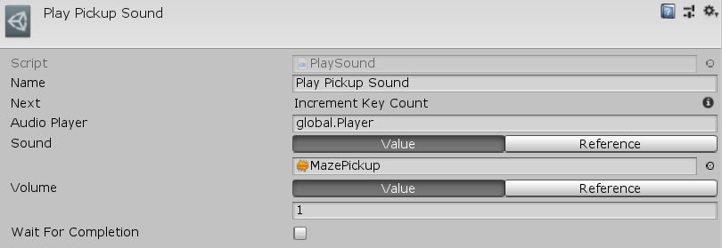

[#manual/play-sound]

## Play Sound

Play Sound Node is an <<manual/instruction-graph-node.html,Instruction Graph Node>> that tells an <<manual/audio-player.html,Audio Player>> to play an https://docs.unity3d.com/ScriptReference/AudioClip.html[AudioClip^]. Create a Play Sound Node in the menu:Create[Animation > Play Sound] menu of the Instruction Graph Window.

See the _"Play Pickup Sound"_ node on the _"MazeKey"_ <<manual/instruction-graph.html,Instruction Graph>> of the Maze project for an example usage.

### Fields

[cols="1,2"]
|===
| Name	| Description

| Audio Player	| A <<reference/variable-reference.html,VariableReference>> to the <<manual/audio-player.html,Audio Player>> to play the sound on
| Sound	| The <<reference/audio-clip-variable-source.html,AudioClipSource>> of the https://docs.unity3d.com/ScriptReference/AudioClip.html[AudioClip^] to play
| Volume	| The <<reference/float-variable-source.html,FloatVariableSource>> of the volume to play the sound at
| Wait For Completion	| Whether to wait for the _Sound_ to finish playing before moving on to the next node
|===

ifdef::backend-multipage_html5[]
<<reference/play-sound.html,Reference>>
endif::[]