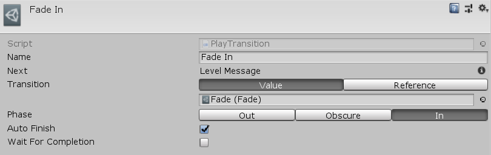

[#manual/play-transition-node]

## Play Transition Node

A Play Transition Node is an <<manual/instruction-graph-node.html,Instruction Graph Node>> that tells the <<manual/transition-manager.html,Transition Manager>> to begin a <<manual/transition.html,Transition>>. If the _AutoFinish_ field is set then the <<manual/transition.html,Transition>> will complete automatically once its phase is completed, otherwise, either a new <<manual/transition.html,Transition>> needs to be started or a <<manual/stop-transition-node.html,Stop Transition Node>> needs to be used. A standard example for when _AutoFinish_ should be `false` would be to maintain the blank screen after fading out while loading the next scene then fading back in when the loading is done. Create a Play Transition Node in the menu:Create[Sequencing > Play Transition] menu of the Instruction Graph Window.

See <<topics/graphs/overview.html,Graphs>> for more information on instruction graphs. +
See the _"MazeStart"_ <<manual/instruction-graph.html,Instruction Graph>> in the Maze project for an example usage.

### Fields

[cols="1,2"]
|===
| Name	| Description

| Transition	| The <<reference/transition-variable-source.html,TransitionVariableSource>> of the <<manual/transition.html,Transition>> to play
| Phase	| The <<referenece/transition-phase.html,TransitionPhase>> to play
| Auto Finish	| Whether or not the <<manual/transition.html,Transition>> should end when it is completed or maintain its visual state until a new one is started
| Wait For Completion	| Whether to wait until the <<manual/transition.html,Transition>> is finished before moving on to the next node
|===

ifdef::backend-multipage_html5[]
<<reference/play-transition-node.html,Reference>>
endif::[]