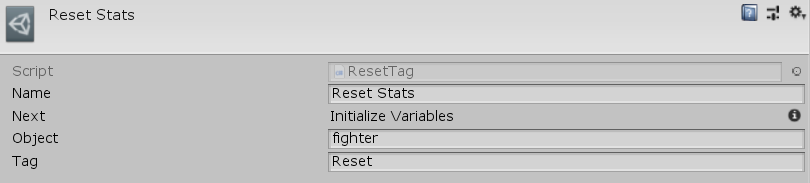

[#manual/reset-tag]

## Reset Tag

Reset Tag Node is an <<manual/instruction-graph-node.html,Instruction Graph Node>> that calls `ResetTag()` on an object that implements <<reference/i-variable-reset.html,IVariableReset>>. Usually this used to reinitialize variables on a <<manual/variable-set-component.html,VariableSetComponent>>. Create a Reset Tag Node in the menu:Create[Composition > Reset Tag] menu of the Instruction Graph Window.

See the _"Reset Stats"_ node on the _"Battle"_ <<manual/instruction-graph.html,Instruction Graph>> of the Battle project for an example usage.

### Fields

[cols="1,2"]
|===
| Name	| Description

| Object	| A <<reference/variable-reference.html,VariableReference>> to the <<reference/i-variable-reset.html,IVariableReset>> object to call `ResetTag()` on
| Tag	| The string name of the tag to reset
|===

ifdef::backend-multipage_html5[]
<<reference/reset-tag.html,Reference>>
endif::[]