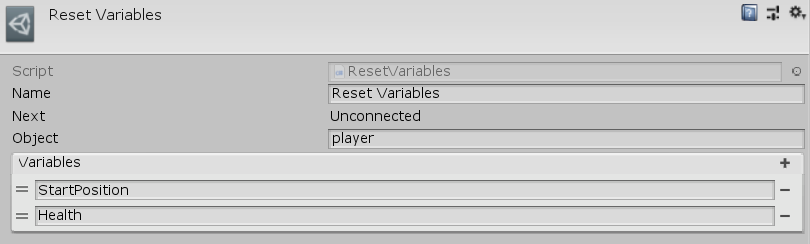

[#manual/reset-variables-node]

## Reset Variables Node

Reset Variables Node is an <<manual/instruction-graph-node.html,Instruction Graph Node>> that calls `ResetVariables()` on an object that implements <<reference/i-variable-reset.html,IVariableReset>>. Usually this is used to reinitialize specific variables on a <<manual/variable-set-component.html,VariableSetComponent>>. Create a Reset Variables Node in the menu:Create[Composition > Reset Variables] menu of the Instruction Graph Window.

See <<topics/variables/defining-variables.html,Variables>> for more information. +
See <<topics/graphs/overview.html,Graphs>> for more information on instruction graphs. +

### Fields

[cols="1,2"]
|===
| Name	| Description

| Object	| A <<reference/variable-reference.html,VariableReference>> to the <<reference/i-variable-reset.html,IVariableReset>> object to call `ResetVariables()` on
| Variables	| The list of string names of the variables to reset
|===

ifdef::backend-multipage_html5[]
<<reference/reset-variables-node.html,Reference>>
endif::[]