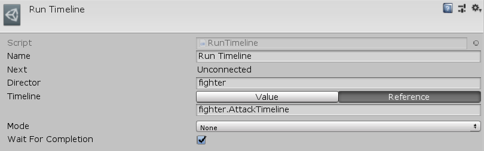

[#manual/run-timeline]

## Run Timeline

Run Timeline Node is an <<manual/instruction-graph-node.html,Instruction Graph Node>> that tells a https://docs.unity3d.com/ScriptReference/Playables.PlayableDirector.html[PlayableDirector^] to https://docs.unity3d.com/ScriptReference/Playables.PlayableDirector.Play.html[Play()^] a https://docs.unity3d.com/2018.3/Documentation/ScriptReference/Timeline.TimelineAsset.html[Timeline^]. Create a Run Timeline Node in the menu:Create[Animation > Run Timeline] menu of the Instruction Graph Window.

See <<topics/graphs-1.html,Graphs>> for more information on instruction graphs. +

### Fields

[cols="1,2"]
|===
| Name	| Description

| Director	|  A <<reference/variable-reference.html,VariableReference>> to the https://docs.unity3d.com/ScriptReference/Playables.PlayableDirector.html[PlayableDirector^] to run the https://docs.unity3d.com/2018.3/Documentation/ScriptReference/Timeline.TimelineAsset.html[Timeline^] on
| Timeline	| The <<reference/timeline-variable-source.html,TimelineVariableSource>> to run
| Mode	| The https://docs.unity3d.com/ScriptReference/Playables.DirectorWrapMode.html[WrapMode^] to use
| Wait For Completion	| Whether to wait for the https://docs.unity3d.com/2018.3/Documentation/ScriptReference/Timeline.TimelineAsset.html[Timeline^] to finish before moving on to the next node
|===

ifdef::backend-multipage_html5[]
<<reference/run-timeline.html,Reference>>
endif::[]