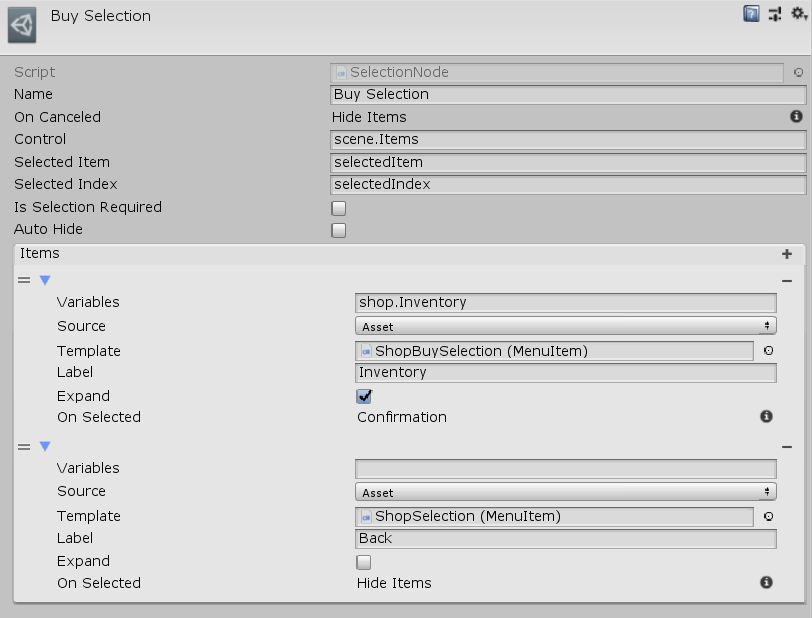

[#manual/selection-node]

## Selection Node

A Selection Node is an <<manua/instruction-graph-node.html,Instruction Graph Node>> that will tell a <<manual/selection-control.html,Selection Control>> to show a list of selections created via <<reference/menu-item-template.html,MenuItemTemplates>>. Showing a selection will automatically activate the <<manual/selection-control.html,Selection Control>> and will hide it once a selection has been made if _AutoHide_ is `true`. If _AutoHide_ is `false` then a <<manual/hide-control-node.html,Hide Control Node>> must be used to deactivate it. When a selection is made the selected item and index will be assigned to <<reference/variables-referenece.html,variables>> specified by _SelectedItem_ and _SelectedIndex_. The graph will then branch to the corresponding node of the <<reference/selection-node-item.html,selected item>>. Create a Selection Node in the menu:Create[Interface > Selection] menu of the Instruction Graph Window.

See the <<topics/interface-4,Menus and Selections>> for more information on selections. +
See the <<topics/graphs-1.html,Graphs>> for more information on instruction graphs. +
See the _"Shop"_ <<manual/instruction-graph.html,Instruction Graph>> in the Shop project for an example usage.

### Fields

[cols="1,2"]
|===
| Name	| Description

| Control	| A <<reference/variable-reference.html,VariableReference>> to the <<manual/selection-control.html,Selection Control>> that should display _Items_
| Selected Item	| A <<reference/variable-reference.html,VariableReference>> to store the <<reference/variable-value.html,Value>> of the selected item in
| Selected Index	| A <<reference/variable-reference.html,VariableReference>> to store the index of the selected item in
| Is Selection Required	| Whether or not the selection can be canceled (no item is selected)
| Auto Hide	| Whether to deactivate the _Control_ once the selection has been made
| Items	| The list of <<reference/selection-node-item,Selection Items>> that will appear in the selection
|===

ifdef::backend-multipage_html5[]
<<reference/selection-node.html,Reference>>
endif::[]