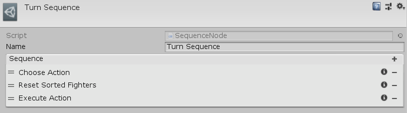

[#manual/sequence-node]

## Sequence Node

A Sequnce Node is a <<manual/instruction-graph-node.html,Instruction Graph Node>> that implements <<reference/i-loop-node.html,ISequenceNode>>. It will run each of its child nodes in sequential order. This is useful for organizational purposes or to continue the execution of a graph after a node that does not have an end connection (like an <<manual/iterate-node.html,Iterate Node>>). Create a Sequnece Node in the menu:Create[Control Flow > Sequence] menu of the Instruction Graph Window.

See <<topics/graphs-3.html,Control Flow>> for more information. +
See the _"Battle"_ <<manual/instruction-graph.html,Instruction Graph>> in the Battle project for an example usage.

### Fields

[cols="1,2"]
|===
| Name	| Description

| Sequence	| The list of <<manual/instruction-graph-node.html,Nodes>> to execute in sequential order
|===

ifdef::backend-multipage_html5[]
<<reference/sequence-node.html,Reference>>
endif::[]