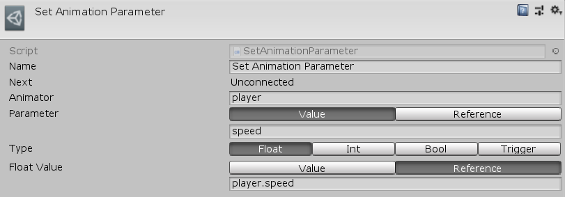

[#manual/set-animation-parameter]

## Set Animation Parameter

Set Animation Parameter Node is an <<manual/instruction-graph-node.html,Instruction Graph Node>> that sets the value of an https://docs.unity3d.com/ScriptReference/AnimatorControllerParameter.html[AnimationParameter^] on an https://docs.unity3d.com/ScriptReference/Animator.html[Animator^]. Create a Set Animation Parameter Node in the menu:Create[Animation > Set Animation Parameter] menu of the Instruction Graph Window.

See <<topics/graphs-1.html,Graphs>> for more information on instruction graphs. +

### Fields

[cols="1,2"]
|===
| Name	| Description

| Parameter	| A <<reference/string-variable-source.html,StringVariableSource>> to the name of the parameter to set
| Type	| The https://docs.unity3d.com/ScriptReference/AnimatorControllerParameterType.html[Type^] of parameter to set
| Animator	| A <<reference/variable-reference.html,VariableReference>> to the https://docs.unity3d.com/ScriptReference/Animator.html[Animator^] to set the parameter on
| Bool Value	| If _Type_ is `Bool`, a <<reference/bool-variable-source.html,BoolVariableSource>> to the value of the bool to set
| Int Value	| If _Type_ is `Int`, a <<reference/int-variable-source.html,IntVariableSource>> to the value of the int to set
| Float Value	| If _Type_ is `Float`, a <<reference/float-variable-source.html,FloatVariableSource>> to the value of the float to set
|===

ifdef::backend-multipage_html5[]
<<reference/set-animation-parameter.html,Reference>>
endif::[]