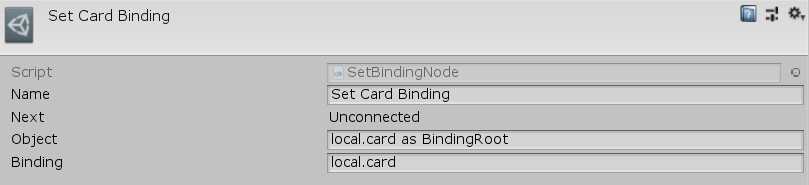

[#manual/set-binding-node]

## Set Binding Node

Set Binding Node is an <<manual/instruction-graph-node.html,Instruction Graph Node>> that sets the <<reference/variable-value.html,Value>> of a <<manual/binding-root.html,Binding Root>> to the resolved <<reference/variable-reference.html,VariableReference>>, _Binding_. Create a Set Binding Node in the menu:Create[Interface > Set Binding] menu of the Instruction Graph Window.

See the _"Set Card Binding"_ node on the _"Load Game"_ <<manual/instruction-graph.html,Instruction Graph>> in the CardGame project for an example usage.

### Fields

[cols="1,2"]
|===
| Name	| Description

| Object	| The <<reference/variable-reference.html,VariableReference>> to the <<manual/binding-root.html,Binding Root>> to set the binding on
| Binding	| The <<reference/variable-reference.html,VariableReference>> to set as the binding
|===

ifdef::backend-multipage_html5[]
<<reference/set-binding-node.html,Reference>>
endif::[]