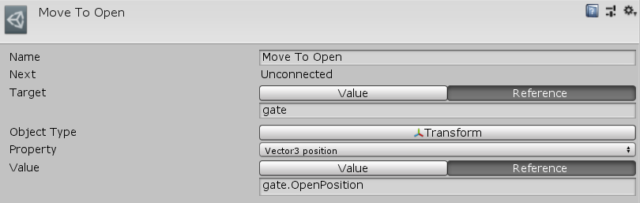

[#manual/set-property-node]

## Set Property Node

A Set Property Node is an <<manual/instruction-graph-node.html,Instruction Graph Node>> used to set any property or field on any https://docs.unity3d.com/ScriptReference/Object.html[Object^] provided that the type of the property or field can be stored in a <<reference/variable-value.html,VariableValue>>. Create a Set Property Node in the menu:Create[Composition > Get Property] menu of the Instruction Graph Window.

See <<topics/graphs-1.html,Graphs>> for more information on instruction graphs. +
See the _"Move To Open"_ node on the _"MazeGateStart"_ <<manual/instruction-graph.html,Instruction Graph>> in the Maze project for an example usage.

### Fields

[cols="1,2"]
|===
| Name	| Description

| Target	| The <<reference/object-variable-source.html,VariableSource>> to the object to set _Value_ on
| Value	| The <<reference/variable-value.html,VariableValue>> to set the property to
|===

ifdef::backend-multipage_html5[]
<<reference/set-property-node.html,Reference>>
endif::[]