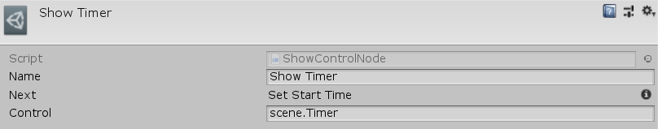

[#manual/show-control-node]

## Show Control Node

A Show Control Node is an <<manual/instruction-graph-node.html,Instruction Graph Node>> that will activate an <<manual/interface-control.html,Interface Control>>. Create a Show Control Node in the menu:Create[Interface > Show Control] menu of the Instruction Graph Window.

See the <<topics/graphs/overview.html,Graphs>> for more information on instruction graphs. +
See the <<topics/interface/controls,Controls>> topic for more information on interface controls. +
See the "Show Timer" node on the "MazeStart" <<manual/instruction-graph,Instruction Graph>> in the Maze project for an example usage.

### Fields

[cols="1,2"]
|===
| Name	| Description

| Control	| A <<reference/variable-reference.html,VariableReference>> to the <<manual/interface-control.html,Interface Control>> to show
|===

ifdef::backend-multipage_html5[]
<<reference/show-control-node.html,Reference>>
endif::[]