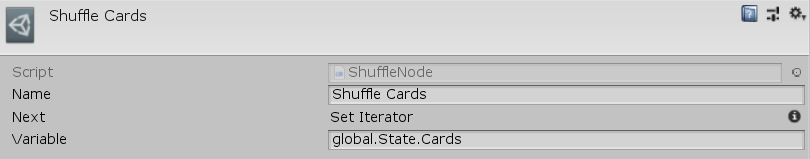

[#manual/shuffle-node]

## Shuffle Node

A Shuffle Node is an <<manual/instruction-graph-node.html,Instruction Graph Node>> that will shuffle an <<reference/i-variable-list.html,IVariableList>>. Create a Shuffle Node in the menu:Create[Composition > Shuffle] menu of the Instruction Graph Window.

See <<topics/graphs-1.html,Graphs>> for more information on instruction graphs. +
See the _"Shuffle Cards"_ node on the _"CardShuffle"_ <<manual/instruction-graph.html,Instruction Graph>> in the CardGame project for an example usage.

### Fields

[cols="1,2"]
|===
| Name	| Description

| Variable	| A <<reference/variable-reference.html,VariableReference>> to the <<reference/i-variable-list.html,IVariableList>> to shuffle
|===

ifdef::backend-multipage_html5[]
<<reference/shuffle-node.html,Reference>>
endif::[]