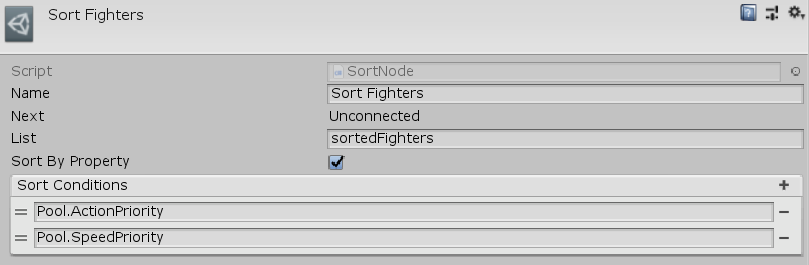

[#manual/sort-node]

## Sort Node

A Shuffle Node is an <<manual/instruction-graph-node.html,Instruction Graph Node>> that will shuffle the given <<reference/variable-list.html,VariableList>>, _List_. If each  <<reference/variable-value.html,Value>> in _List_ is an <<reference/i-variable-stores.html,IVariableStore>>, then they can be sorted by <<reference/variable-value,Values>> on that <<reference/i-variable-stores.html,IVariableStore>> (similar to _System.Linq_'s `SortBy().ThenBy()` methods). Create a Sort Node in the menu:Create[Composition > Sort] menu of the Instruction Graph Window.

See <<topics/graphs-1.html,Graphs>> for more information on instruction graphs. +
See the _"Sort Fighters"_ node on the _"Battle"_ <<manual/instruction-graph.html,Instruction Graph>> in the Battle project for an example usage.

### Fields

[cols="1,2"]
|===
| Name	| Description

| List	| A <<reference/variable-reference.html,VariableReference>> to the <<reference/variable-list.html,VariableList>> to sort
| Sort By Property	| Whether to sort each <<reference/variable-value.html,Value>> in _List_ by itself or by properties on it (if it is an <<reference/i-variable-stores.html,IVariableStore>>)
| Sort Conditions	| If _SortByProperty_ is `true`, then a list of <<reference/variable-reference.html,VariableReferences>> on each item in _List_ to sort by sequentially
|===

ifdef::backend-multipage_html5[]
<<reference/sort-node.html,Reference>>
endif::[]