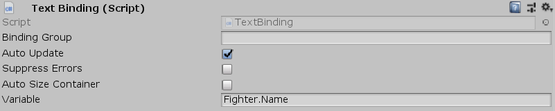

[#manual/text-binding]

## Text Binding

Text Binding is a <<manual/string-binding.html,String Binding>> that will bind text based on a <<reference/variable-reference.html,VariableReference>>. If _Variable_ is invalid then the text component will be disabled.

See the _"Name"_ objects in the _"Battle"_ scene of the Battle project for an example usage.

### Fields

[cols="1,2"]
|===
| Name	| Description

| Variable	| The <<reference/variable-reference.html,VariableReference>> to retrieve the text from
|===

ifdef::backend-multipage_html5[]
<<reference/text-binding.html,Reference>>
endif::[]