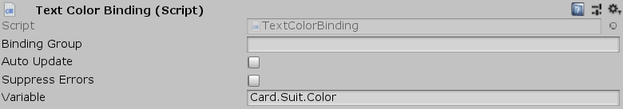

[#manual/text-color-binding]

## Text Color Binding

Text Color Binding is a <<manual/variable-binding.html,Variable Binding>> that will set the color of a sibling http://digitalnativestudios.com/textmeshpro/docs/[TextMeshPro^] component based on the given <<reference/variable-reference.html,VariableReference>>. If _Variable_ is invalid, then the text will be disabled.

See the _"Card"_ prefab in the CardGame project for an example usage.

### Fields

[cols="1,2"]
|===
| Name	| Description

| Variable	| A <<reference/variable-reference.html,VariableReference>> to the https://docs.unity3d.com/ScriptReference/Color.html[Color^] to use
|===

ifdef::backend-multipage_html5[]
<<reference/text-color-binding.html,Reference>>
endif::[]