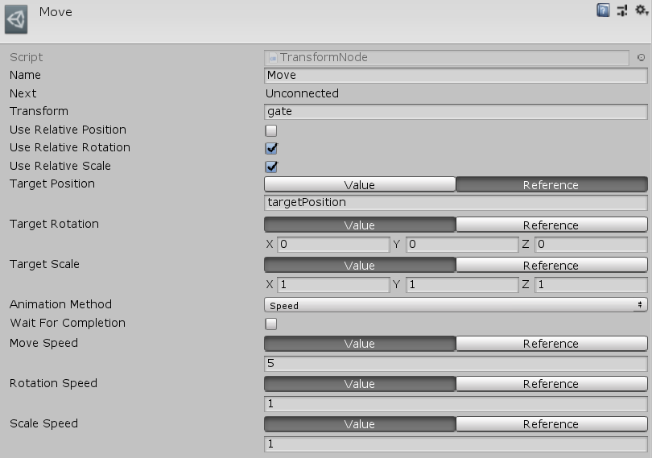

[#manual/transform-node]

## Transform Node

Transform Node is an <<manual/instruction-graph-node.html,Intruction Graph Node>>, that will animate a https://docs.unity3d.com/ScriptReference/Transform.html[Transform^] component toward a _TargetPosition_, _TargetRotation_, and _TargetScale_. Targets can be specified to be relative to the current _Transform_ or in world space. Animation can happen instantly or at either a speed or over a duration. If the target https://docs.unity3d.com/ScriptReference/Transform.html[Transform^] has a https://docs.unity3d.com/ScriptReference/Rigidbody.html[Rigidbody^] attached to it then the animation will use its corresponding movement methods to maintain its state in the collision system. menu:Create[Sequencing > Transform Object] menu of the Instruction Graph Window.

CAUTION: If the _Transform_ cannot reach its destination (due to collisions or other circumstances) then the node will never cease its execution

See <<topics/graphs/overview.html,Graphs>> for more information on instruction graphs. +
See the "Move" node on the "MazeGate" <<manual/instruction-graph,Instruction Graph>> in the Maze project for an example usage.

### Fields

[cols="1,2"]
|===
| Name	| Description

| Transform	| The <<reference/variable-reference.html,VariableReference>> to the https://docs.unity3d.com/ScriptReference/Transform.html[Transform^] to enable
| Use Relative Position	| If set _TargetPosition_ will specified relative to the initial _Transform_
| Use Relative Rotation	| If set _TargetRotation_ will specified relative to the initial _Transform_
| Use Relative Scale	| If set _TargetScale_ will specified relative to the initial _Transform_
| Target Position	| The <<reference/vector3-variable-source.html,Vector3VariableSource>> to the target position of _Transform_
| Target Rotation	| The <<reference/vector3-variable-source.html,Vector3VariableSource>> to the target rotation (in euler angles) of _Transform_
| Target Scale	| The <<reference/vector3-variable-source.html,Vector3VariableSource>> to the target position of _Transform_
| Animation Method	| The <<reference/transform-node-animation-type,Type>> of animation to use
| Wait For Completion	| Whether to wait until _Transfrom_ reaches the destination before moving on to the next node
| Duration	| If _AnimationMethod_ is `Duration`, a <<reference/float-variable-source.html,FloatVariableSource>> to the amount of time (in seconds) it takes to reach the destination
| Move Speed	| If _AnimationMethod_ is `Speed`, <<reference/float-variable-source.html,FloatVariableSource>> to the speed the _Transform_ will move
| Rotation Speed	|  If _AnimationMethod_ is `Speed`, <<reference/float-variable-source.html,FloatVariableSource>> to the speed the _Transform_ will rotate
| Scale Speed	|  If _AnimationMethod_ is `Speed`, <<reference/float-variable-source.html,FloatVariableSource>> to the speed the _Transform_ will change size
|===

ifdef::backend-multipage_html5[]
<<reference/transform-node.html,Reference>>
endif::[]