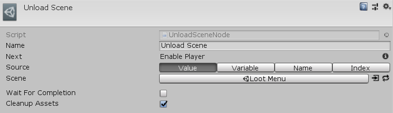

[#manual/unload-scene-node]

## Unload Scene Node

An Unload Scene Node is an <<manual/instruction-graph-node.html,Instruction Graph Node>> that will unload https://docs.unity3d.com/ScriptReference/SceneManagement.Scene.html[Scene^]. The scene to be unloaded can be a link:/projects/unity-utilities/documentation/#/v10/reference/scene-reference[SceneReference^], string name, build index, or a <<reference/variable-reference.html,VariableReference>> to a string name or build index. If _WaitForCompletion_ is specified, the graph will not move to the next node until the scene has fully completed unloading. Create an Unload Scene Node in the menu:Create[Sequencing > Unload Scene] menu of the Instruction Graph Window.

See the _"Unload Scene"_ node on the _"Hide Loot Inventory"_ <<manual/instruction-graph.html,Instruction Graph>> in the Loot project for an example usage.

### Fields

[cols="1,2"]
|===
| Name	| Description

| Source	| The <<referenece/unload-scene-node-scene-source,SourceType>> to unload the scene based off of
| Scene	| If `Value`, the link:/projects/unity-utilities/documentation/#/v10/reference/scene-reference[SceneReference^] to unload
| Scene Variable	| If `Variable`, the <<reference/variable-reference.html,VariableReference>> to a string name or build index of the sceen to unload
| Scene Name	| If `Name`, the string name of the scene to unload
| Scene Index	| If `Index`, the build index of the scene to unload
| Wait For Completion	| Whether to wait until the scene has completed unloading before moving to the next node
| Cleanup Assets	| Whether to call https://docs.unity3d.com/ScriptReference/Resources.UnloadUnusedAssets.html[UnloadUnusedAssets()^] after scene is unloaded
|===

ifdef::backend-multipage_html5[]
<<reference/unload-scene-node.html,Reference>>
endif::[]