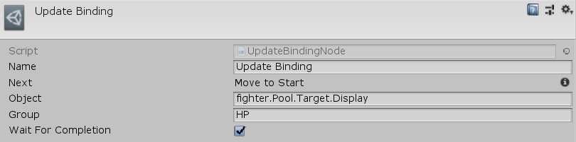

[#manual/update-binding-node]

## Update Binding Node

Udpate Binding Node is an <<manual/instruction-graph-node.html,Instruction Graph Node>> that tells the binding root <<manual/binding-root.html,Binding Root>>, _Object_ to update its <<manual/variable-binding.html,VariableBindings>>. If _Object_ is an <<manual/interface-control.html,Interface Control>> then each of the control's _DependentObjects_ will also have its bindings updated. If any of the bindings utilize animation (such as <<manual/bar-binding,Bar Binding>>) and _WaitForCompletion_ is set, then the graph will not move to the next node until the binding animation is finished. Use the _Group_ string to identify only the <<manual/variable-binding.html,VariableBindings>> with the corresponding _BindingGroup_ to update. Create an Update Binding Node in the menu:Create[Interface > Update Binding] menu of the Instruction Graph Window.

See <<topics/graphs/overview.html,Graphs>> for more information on instruction graphs. +
See <<topics/bindings/variable-bindings.html,Variable Bindings>> for more information on variable bindings. +
See the _"Update Binding"_ node on the _"BattleScratch"_ <<manual/instruction-graph.html,Instruction Graph>> in the Battle project for an example usage.

### Fields

[cols="1,2"]
|===
| Name	| Description

| Object	| The <<reference/variable-reference.html,VariableReference>> to the <<manual/binding-root.html,Binding Root>> to set the binding on
| Group	| The string name of the _BindingGroup_ to update - if empty, all <<manual/variable-binding.html,VariableBindings>> will be updated
| Wait For Completion	| Whether to wait for the completion of any binding animations before moving on to the next node
|===

ifdef::backend-multipage_html5[]
<<reference/update-binding-node.html,Reference>>
endif::[]