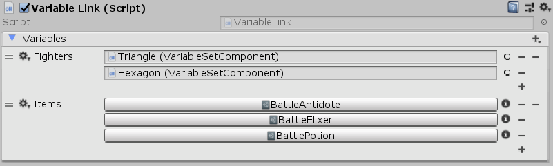

[#manual/variable-link]

## Variable Link

A Variable Link is a https://docs.unity3d.com/ScriptReference/MonoBehaviour.html[MonoBehaviour^] used to add <<reference/variable-value.html,Variables>> to the <<manual/composition-manager.html,Composition Manager>>'s `global` <<reference/variable-store.html,Variable Store>>.

See the _"Main Camera"_ object in the _"Battle"_ scene of the Battle project for an example usage.

### Fields

[cols="1,2"]
|===
| Name	| Description

| Variables	| A <<reference/variable-pool.html,Variable Pool>>, each of whose <<reference/variable-value.html,Variable Values>> will be added to the `global` store
|===

ifdef::backend-multipage_html5[]
<<reference/variable-link.html,Reference>>
endif::[]