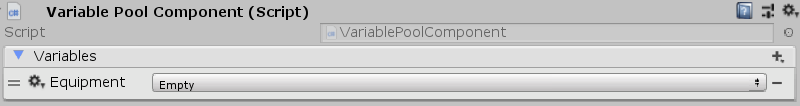

[#manual/variable-pool-component]

## Variable Pool Component

A Variable Pool Component is a https://docs.unity3d.com/ScriptReference/MonoBehaviour.html[MonoBehaviour^] that adds a <<reference/variable-pool.html,Variable Pool>> to the object. This allows it to have a list of <<reference/variable-value.html,Variables>> without being constrained by a <<manual/variable-schema.html,Variable Schema>>.

See the _"Loot Equipment Pickup"_ prefab in the Loot project for an example usage.

### Fields

[cols="1,2"]
|===
| Name	| Description

| Variables	| The <<reference/variable-pool.html,Variable Pool>> of <<reference/variable-value.html,Values>> that can be set, stored, and accessed on this object
|===

ifdef::backend-multipage_html5[]
<<reference/variable-pool-component.html,Reference>>
endif::[]