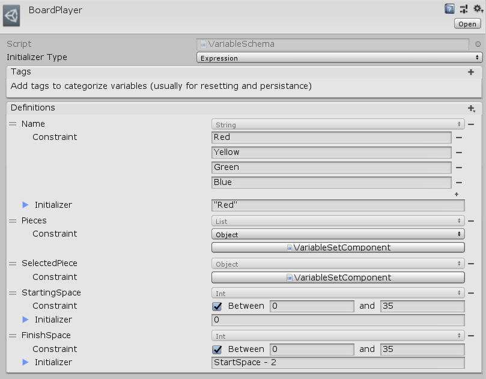

[#manual/variable-schema]

## Variable Schema

A VariableSchema is an https://docs.unity3d.com/ScriptReference/ScriptableObject.html[Asset^] used to define the variables that are available to an <<reference/i-variable-store.html,IVariableStore>> object, usually a <<manual/variable-set-component.html,Variable Set Component>> or <<reference/variable-set-asset.html,Variable Set Asset>>. This improves the editor experience for working with those object types along with enforcing constraints so typos or other mistaken accesses can be caught and reported at runtime.

### Fields

[cols="1,2"]
|===
| Name	| Description

| Initializer Type	| Whether to initialize the variables in that use this schema with an <<reference/expression.html,Expression>> or a default value
| Tags	| A list of strings than can be used to categorize each variable in the schema - usually so that they can be reinitialized or saved later 
|===

ifdef::backend-multipage_html5[]
<<reference/variable-schema.html,Reference>>
endif::[]