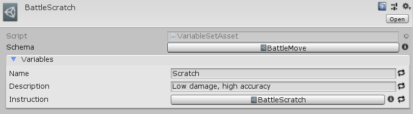

[#manual/variable-set-asset]

## Variable Set Asset

A Variable Set Asset is a https://docs.unity3d.com/ScriptReference/ScriptableObject.html[ScriptableObject^] that adds a <<reference/variable-pool.html,Variable Set>> to the asset. This allows it to have a list of <<reference/variable-value.html,Variables>> that are defined by a reference to a <<manual/variable-schema.html,Variable Schema>>. A derived class of Variable Set Asset can use the <<reference/mapped-variable-attribute.html,MappedVariableAttribute>> to add its fields and properties to the _Variables_ list in addition to those defined by _Schema_. Create a Variable Set Asset through the menu:Create[PiRho Soft > Variable Set] menu in the project view.

See the assets in the _"Moves"_ and _"Items"_ folders in the Battle project for an example usage.

### Fields

[cols="1,2"]
|===
| Name	| Description

| Schema	| The <<manual/variable-schema.html,Variable Schema>> to use for this <<reference/variable-set.html,Variable Set>>
| Variables	| The list of <<manual/variable-value,Variables>> mapped from _Schema_ and derived script classes
|===

ifdef::backend-multipage_html5[]
<<reference/variable-set-asset.html,Reference>>
endif::[]