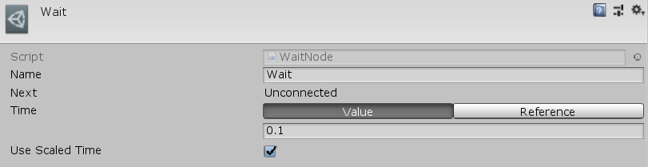

[#manual/wait-node]

## Wait Node

A Wait Node is an <<manual/instruction-graph-node.html,Instruction Graph Node>> that waits for an amount of time (scaled or realtime) before continuing on to the next node. Create a Wait Node in the menu:Create[Sequencing > Wait] menu of the Instruction Graph Window.

See the _"BoardTakeTurn"_ <<manual/instruction-graph.html,Instruction Graph>> in the BoardGame project for an example usage.

### Fields

[cols="1,2"]
|===
| Name	| Description

| Time	| A <<reference/float-variable-source.html,FloatVariableSource>> to the value of the amount of time to wait
| Use Scaled Time	| If `true`, use https://docs.unity3d.com/ScriptReference/WaitForSeconds.html[WaitForSeconds()^] - if `false`, https://docs.unity3d.com/ScriptReference/WaitForSecondsRealtime.html[WaitForSecondsRealtime()^]
|===

ifdef::backend-multipage_html5[]
<<reference/wait-node.html,Reference>>
endif::[]