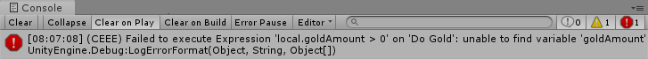

[#overview/log-descriptions]

## Log Descriptions

The following lists all the warning and error messages that may be printed to the https://docs.unity3d.com/Manual/Console.html[Console^] by the Composition Framework. Each message has an associated id that corresponds to an entry in this list for easy searchability. For example the following image shows an error with id `CEEE`. Searching this page for an id will take you to the entry which will explain in more detail what the message means, the effect on execution, and potential ways to fix it.

### General Tips

When dealing with <<topics/variables-4.html,VariableReference>> errors, the <<topics/graphs-5.html,Watch Window>> can be extremely useful. Global variables can be investigated at any time and variables on a specific <<topics/graphs-1.html,InstructionGraph>> can be investigated by <<topics/graphs-5.html,setting a breakpoint>> on a node.

<<topics/variables-5.html,Expression>> errors can be harder to track down. If the text box containing the <<topics/variables-5.html,Expression>> is red, the issue is with the actual structure of the <<topics/variables-5.html,Expression>> and details will be displayed. In this case the error state will update as the <<topics/variables-5.html,Expression>> is modified so it is easy to see when the issue has been resolved. If the <<topics/variables-5.html,Expression>> is valid and an error is printed at runtime, the issue is usually related to a <<topics/variables-4.html,VariableReference>> and the above tip for using the <<topics/graphs-5.html,Watch Window>> applies.

### Warnings

#### CAANPIL

Unable to wait on Animation Player '{0}': the Animation Clip '{1}' was set to loop and would have never finished

[cols="1,8"]
|===
| {0} | The https://docs.unity3d.com/Manual/GameObjects.html[GameObject^] containing the <<manual/animation-player.html,AnimationPlayer>> that triggered the warning.
| {1} | The https://docs.unity3d.com/Manual/AnimationClips.html[AnimationClip^] that is being played.
|===

Effect:: The https://docs.unity3d.com/Manual/AnimationClips.html[AnimationClip^] will still play successfully but the wait setting will be ignored.

Resolution:: Either tell the <<manual/animation-player.html,AnimationPlayer>> to play the animation without looping (i.e call _PlayAnimation_ instead of _PlayAnimationAndWait_ or clear the _WaitForCompletion_ flag if using a <<manual/play-animation-node.html,PlayAnimationNode>>) or change the https://docs.unity3d.com/Manual/AnimationClips.html[AnimationClip^] to one that doesn't loop.

#### CAAUPIL

Unable to wait on Audio Player '{0}': the Audio Clip '{1}' was set to loop and would have never finished

[cols="1,8"]
|===
| {0} | The https://docs.unity3d.com/Manual/GameObjects.html[GameObject^] containing the <<manual/audio-player.html,AudioPlayer>> that triggered the warning.
| {1} | The https://docs.unity3d.com/Manual/class-AudioClip.html.html[AudioClip^] that is being played.
|===

Effect:: The https://docs.unity3d.com/Manual/AudioClips.html[AudioClip^] will still play successfully but the wait setting will be ignored.

Resolution:: Either tell the <<manual/audio-player.html,AudioPlayer>> to play the sound without looping (call _PlaySound_ instead of _PlaySoundAndWait_ or clear the _WaitForCompletion_ flag if using a <<manual/play-sound-node.html,PlaySoundNode>>) or change the https://docs.unity3d.com/Manual/AudioClips.html[AudioClip^] to one that doesn't loop.

#### CBBBWT

Bar Binding '{0}' has an Image with a type that is not 'Filled'

[cols="1,8"]
|===
| {0} | The https://docs.unity3d.com/Manual/GameObjects.html[GameObject^] containing the <<manual/bar-binding.html,BarBinding>> that triggered the warning.
|===

Effect:: The https://docs.unity3d.com/Manual/script-Image.html[Image^] will have its _type_ set to `Filled` with default values for the other fill related properties.

Resolution:: Change the `Image Type` of the https://docs.unity3d.com/Manual/script-Image.html[Image^] to `Filled`.

#### CBLBMT

Unable to create item for List Binding '{0}': the Template is null

[cols="1,8"]
|===
| {0} | The <<manual/list-binding.html,ListBinding>> that triggered the warning.
|===

Effect:: The <<manual/list-binding.html,ListBinding>> will do nothing.

Resolution:: Set the _Template_ property of the <<manual/list-binding.html,ListBinding>>.

#### CDONIO

Unable to disable object for node '{0)': the object '{1}' is not a GameObject, Behaviour, or Renderer

[cols="1,8"]
|===
| {0} | The <<manual/disable-object-node.html,DisableObjectNode>> that triggered the warning.
| {1} | The <<topics/variables-4.html,VariableReference>> assigned to _Target_ that resolved to an invalid type.
|===

Effect:: The <<manual/disable-object-node.html,InstructionGraphNode>> will do nothing.

Resolution:: Change _Target_ so it resolves to either a https://docs.unity3d.com/Manual/GameObjects.html[GameObject^], https://docs.unity3d.com/ScriptReference/Behaviour.html[Behaviour^], or https://docs.unity3d.com/ScriptReference/Renderer.html[Renderer^].

#### CEBFC

Unable to bind enabled state for binding '{0}': the Command '{1}' failed with error '{2}'

[cols="1,8"]
|===
| {0} | The <<manual/enable-binding.html,EnableBinding>> that triggered the warning.
| {1} | The name of the command that failed.
| {2} | The error message reported by the command.
|===

Effect:: The enabled state of _Object_ will not be changed.

Resolution:: If the reported error ({2}) indicates a parameter is invalid, the _Condition_ <<topics/variables-5.html,Expression>> is calling the command incorrectly. Otherwise, the command itself has an error and needs to be edited directly. The message should provide details on how to go about fixing the issue.

#### CEBFE

Unable to bind enabled state for binding '{0}': the expression '{1}' failed with error '{2}'

[cols="1,8"]
|===
| {0} | The <<manual/enable-binding.html,EnableBinding>> that triggered the warning.
| {1} | The statement in the _Condition_ <<topics/variables-5.html,Expression>> that failed.
| {2} | The error message reported by the expression.
|===

Effect:: The enabled state of _Object_ will not be changed.

Resolution:: The reported error ({2}) should provide details on how to go about fixing the _Condition_ <<topics/variables-5.html,Expression>>.

#### CEBIO

Unable to bind enabled state for binding '{0)': the object '{1}' is not a GameObject, Behaviour, or Renderer

[cols="1,8"]
|===
| {0} | The <<manual/enable-binding.html,EnableBinding>> that triggered the warning.
| {1} | The https://docs.unity3d.com/ScriptReference/Object.html[Object^] assigned to _Object_.
|===

Effect:: The enabled state of _Object_ will not be changed.

Resolution:: Change _Object_ to either a https://docs.unity3d.com/Manual/GameObjects.html[GameObject^], https://docs.unity3d.com/ScriptReference/Behaviour.html[Behaviour^], or https://docs.unity3d.com/ScriptReference/Renderer.html[Renderer^].

#### CEBIV

Unable to bind enabled state for binding '{0}': the expression '{1}' did not evaluate to a bool

[cols="1,8"]
|===
| {0} | The <<manual/enable-binding.html,EnableBinding>> that triggered the warning.
| {1} | The final statement in the _Condition_ <<topics/variables-5.html,Expression>>.
|===

Effect:: The enabled state of _Object_ will not be changed.

Resolution:: Change _Condition_ so that the final statement results in a bool value, potentially by using a comparison operation.

#### CEBMV

Unable to bind enabled state for binding '{0}': the expression is empty

[cols="1,8"]
|===
| {0} | The <<manual/enable-binding.html,EnableBinding>> that triggered the warning.
|===

Effect:: The enabled state of _Object_ will not be changed.

Resolution:: Set the _Condition_ <<topics/variables-5.html,Expression>>.

#### CEIR

'{0}' expected the Expression '{1}' to return type '{2}' but it instead returned type '{3}'

[cols="1,8"]
|===
| {0} | The https://docs.unity3d.com/ScriptReference/Object.html[Object^] that executed the <<topics/variables-5.html,Expression>>.
| {1} | The final statement of the <<topics/variables-5.html,Expression>> that was expected to result in a specific type.
| {2} | The <<topics/variables-2.html,VariableType>> the caller expected from the result of the expression.
| {3} | The actual <<topics/variables-2.html,VariableType>> of the result of the expression.
|===

Effect:: The caller ({0}) will still be returned the result and how that result is used is dependent on the specific scenario.

Resolution:: Change the expression defined on the caller ({0}) so that the final statement results in the expected type ({3}).

#### CEONIO

Unable to enable object for node '{0)': the object '{1}' is not a GameObject, Behaviour, or Renderer

[cols="1,8"]
|===
| {0} | The <<manual/enable-object-node.html,EnableObjectNode>> that triggered the warning.
| {1} | The <<topics/variables-4.html,VariableReference>> assigned to _Target_ that resolved to an invalid type.
|===

Effect:: The <<manual/enable-object-node.html,EnableObjectNode>> will do nothing.

Resolution:: Change _Target_ so it resolves to either a https://docs.unity3d.com/Manual/GameObjects.html[GameObject^], https://docs.unity3d.com/ScriptReference/Behaviour.html[Behaviour^], or https://docs.unity3d.com/ScriptReference/Renderer.html[Renderer^].

#### CEXBFC

Unable to bind text for binding '{0}': the Command '{1}' failed with error '{2}'

[cols="1,8"]
|===
| {0} | The <<manual/expression-binding.html,ExpressionBinding>> that triggered the warning.
| {1} | The name of the command that failed.
| {2} | The error message reported by the command.
|===

Effect:: The http://digitalnativestudios.com/textmeshpro/docs/[TMP_Text^] will be hidden and cleared.

Resolution:: If the reported error ({2}) indicates a parameter is invalid, the _Expression_ <<topics/variables-5.html,Expression>> is calling the command incorrectly. Otherwise, the command itself has an error and needs to be edited directly. The message should provide details on how to go about fixing the issue.

#### CEXBFE

Unable to bind text for binding '{0}': the expression '{1}' failed with error '{2}'

[cols="1,8"]
|===
| {0} | The <<manual/expression-binding.html,ExpressionBinding>> that triggered the warning.
| {1} | The statement in the _Expression_ <<topics/variables-5.html,Expression>> that failed.
| {2} | The error message reported by the expression.
|===

Effect:: The http://digitalnativestudios.com/textmeshpro/docs/[TMP_Text^] will be hidden and cleared.

Resolution:: The reported error ({2}) should provide details on how to go about fixing the _Expression_ <<topics/variables-5.html,Expression>>.

#### CEXBMV

Unable to bind text for binding '{0}': the expression is empty

[cols="1,8"]
|===
| {0} | The <<manual/expression-binding.html,ExpressionBinding>> that triggered the warning.
|===

Effect:: The http://digitalnativestudios.com/textmeshpro/docs/[TMP_Text^] will be hidden and cleared.

Resolution:: Set the _Expression_ <<topics/variables-5.html,Expression>>.

#### CIGNIA

Failed to assign to variable '{0}' from node '{1}': the variable has an incompatible type

[cols="1,8"]
|===
| {0} | The <<topics/variables-4.html,VariableReference>> that resolved to an invalid <<topics/variables-2.html,VariableType>>.
| {1} | The <<manual/instruction-graph-node.html,InstructionGraphNode>> that attempted to assign to the variable.
|===

Effect:: The assignment will not be performed.

Resolution:: Change the <<topics/variables-4.html,VariableReference>> on the <<manual/instruction-graph-node.html,InstructionGraphNode>> so it either resolves to a variable with the correct type or resolves to a variable that can be assigned any type.

#### CIGNIE

Failed to resolve variable '{0}' on node '{1}': the variable has enum type '{2}' and should have enum type '{3}'

[cols="1,8"]
|===
| {0} | The <<topics/variables-4.html,VariableReference>> that resolved to an invalid enum type.
| {1} | The <<manual/instruction-graph-node.html,InstructionGraphNode>> that attempted to resolve the variable.
|===

Effect:: The effect depends on the <<manual/instruction-graph-node.html,InstructionGraphNode>>. Usually it will skip performing its action but it may use a default value instead.

Resolution:: Change the <<topics/variables-4.html,VariableReference>> on the <<manual/instruction-graph-node.html,InstructionGraphNode>> so it resolves to a variable with the correct enum type.

#### CIGNIO

Failed to resolve variable '{0}' on node '{1}': the object '{2}' is a '{3}' and cannot be converted to a '{4}'

[cols="1,8"]
|===
| {0} | The <<topics/variables-4.html,VariableReference>> that resolved to an invalid object type.
| {1} | The <<manual/instruction-graph-node.html,InstructionGraphNode>> that attempted to resolve the variable.
| {2} | The https://docs.unity3d.com/ScriptReference/Object.html[Object^] that was resolved but is not the correct type.
| {3} | The type of the resolved https://docs.unity3d.com/ScriptReference/Object.html[Object^].
| {4} | The type the <<manual/instruction-graph-node.html,InstructionGraphNode>> expected.
|===

Effect:: The effect depends on the <<manual/instruction-graph-node.html,InstructionGraphNode>>. Usually it will skip performing its action but it may use a default value instead.

Resolution:: Change the <<topics/variables-4.html,VariableReference>> on the <<manual/instruction-graph-node.html,InstructionGraphNode>> so it resolves to a variable with the correct object type.

#### CIGNIT

Failed to resolve variable '{0}' on node '{1}': the value is a '{2}' and cannot be converted to a '{3}'

[cols="1,8"]
|===
| {0} | The <<topics/variables-4.html,VariableReference>> that resolved to an invalid type.
| {1} | The <<manual/instruction-graph-node.html,InstructionGraphNode>> that attempted to resolve the variable.
| {2} | The type of the resolved value.
| {3} | The type the <<manual/instruction-graph-node.html,InstructionGraphNode>> expected.
|===

Effect:: The effect depends on the <<manual/instruction-graph-node.html,InstructionGraphNode>>. Usually it will skip performing its action but it may use a default value instead.

Resolution:: Change the <<topics/variables-4.html,VariableReference>> on the <<manual/instruction-graph-node.html,InstructionGraphNode>> so it resolves to a variable with the correct type.

#### CIGNIV

Failed to resolve variable '{0}' on node '{1}': the variable has type '{2}' and should have type '{3}'

[cols="1,8"]
|===
| {0} | The <<topics/variables-4.html,VariableReference>> that resolved to an invalid <<topics/variables-2.html,VariableType>>.
| {1} | The <<manual/instruction-graph-node.html,InstructionGraphNode>> that attempted to resolve the variable.
| {2} | The <<topics/variables-2.html,VariableType>> of the resolved value.
| {3} | The <<topics/variables-2.html,VariableType>> the <<manual/instruction-graph-node.html,InstructionGraphNode>> expected.
|===

Effect:: The effect depends on the <<manual/instruction-graph-node.html,InstructionGraphNode>>. Usually it will skip performing its action but it may use a default value instead.

Resolution:: Change the <<topics/variables-4.html,VariableReference>> on the <<manual/instruction-graph-node.html,InstructionGraphNode>> so it resolves to a variable with the correct type.

#### CIGNMA

Failed to assign to variable '{0}' from node '{1}': the variable could not be found

[cols="1,8"]
|===
| {0} | The <<topics/variables-4.html,VariableReference>> that could not be resolved.
| {1} | The <<manual/instruction-graph-node.html,InstructionGraphNode>> that attempted to assign to the variable.
|===

Effect:: The assignment will not be performed.

Resolution:: Change the <<topics/variables-4.html,VariableReference>> on the <<manual/instruction-graph-node.html,InstructionGraphNode>> so it resolves to a valid variable.

#### CIGNMV

Failed to resolve variable '{0}' on node '{1}': the variable could not be found

[cols="1,8"]
|===
| {0} | The <<topics/variables-4.html,VariableReference>> that could not be resolved.
| {1} | The <<manual/instruction-graph-node.html,InstructionGraphNode>> that attempted to resolve the variable.
|===

Effect:: The effect depends on the <<manual/instruction-graph-node.html,InstructionGraphNode>>. Usually it will skip performing its action but it may use a default value instead.

Resolution:: Change the <<topics/variables-4.html,VariableReference>> on the <<manual/instruction-graph-node.html,InstructionGraphNode>> so it resolves to a valid variable.

#### CIGNROA

Failed to assign to variable '{0}' from node '{1}': the variable is read only

[cols="1,8"]
|===
| {0} | The <<topics/variables-4.html,VariableReference>> that resolved to a read only variable.
| {1} | The <<manual/instruction-graph-node.html,InstructionGraphNode>> that attempted to assign to the variable.
|===

Effect:: The assignment will not be performed.

Resolution:: Change the <<topics/variables-4.html,VariableReference>> on the <<manual/instruction-graph-node.html,InstructionGraphNode>> so it resolves to a writable variable.

#### CIMMV

Unable to get text from Message '{0}': the Variable '{1}' could not be found

[cols="1,8"]
|===
| {0} | The format of the <<topics/interface-3.html,Message>> that is being resolved.
| {1} | The <<topics/variables-4.html,VariableReference>> that could not be found.
|===

Effect:: The text of the message will have the failed section omitted.

Resolution:: Change the <<topics/variables-4.html,VariableReference>> in the <<topics/interface-3.html,Message>> to a valid variable.

#### CNBIV

Failed to resolve variable '{0}' on binding '{1}': the variable has type '{2}' and should have type 'Int' or 'Float'

[cols="1,8"]
|===
| {0} | The <<topics/variables-4.html,VariableReference>> that resolved to an invalid <<topics/variables-2.html,VariableType>>.
| {1} | The <<manual/number-binding.html,NumberBinding>> that attempted to resolve the variable.
| {2} | The <<topics/variables-2.html,VariableType>> of the resolved value.
|===

Effect:: The http://digitalnativestudios.com/textmeshpro/docs/[TMP_Text^] will be hidden and cleared.

Resolution:: If the effect of disabling the http://digitalnativestudios.com/textmeshpro/docs/[TMP_Text^] is desired, set _Suppress Errors_ on the <<manual/number-binding.html,NumberBinding>>. Otherwise, change the <<topics/variables-4.html,VariableReference>> to a valid variable.

#### CNSLS

Unable to load scene on node '{0}': the variable '{1}' could not be found

[cols="1,8"]
|===
| {0} | The <<manual/load-scene-node.html,LoadSceneNode>> that attempted to resolve the variable.
| {1} | The <<topics/variables-4.html,VariableReference>> that could not be found.
|===

Effect:: No scenes will be loaded or unloaded and the <<manual/load-scene-node.html,LoadSceneNode>> will complete immediately.

Resolution:: Change the <<topics/variables-4.html,VariableReference>> to a variable that resolves to either an `Int` or `String`.

#### CNSUS

Unable to unload scene for node '{0}': the scene '{1}' could not be found

[cols="1,8"]
|===
| {0} | The <<manual/unload-scene-node.html,UnloadSceneNode>> that attempted to resolve the variable.
| {1} | The <<topics/variables-4.html,VariableReference>> that could not be found.
|===

Effect:: No scenes will be unloaded and the <<manual/unload-scene-node.html,UnloadSceneNode>> will complete immediately.

Resolution:: Change the <<topics/variables-4.html,VariableReference>> to a variable that resolves to either an `Int` or `String`.

#### CVBIA

Failed to assign to variable '{0}' from binding '{1}': the variable has an incompatible type

[cols="1,8"]
|===
| {0} | The <<topics/variables-4.html,VariableReference>> that resolved to an invalid <<topics/variables-2.html,VariableType>>.
| {1} | The <<manual/variable-binding.html,VariableBinding>> that attempted to assign to the variable.
|===

Effect:: The assignment will not be performed.

Resolution:: Change the <<topics/variables-4.html,VariableReference>> on the <<manual/variable-binding.html,VariableBinding>> so it either resolves to a variable with the correct type or resolves to a variable that can be assigned any type.

#### CVBIE

Failed to resolve variable '{0}' on binding '{1}': the variable has enum type '{2}' and should have enum type '{3}'

[cols="1,8"]
|===
| {0} | The <<topics/variables-4.html,VariableReference>> that resolved to an invalid enum type.
| {1} | The <<manual/variable-binding.html,VariableBinding>> that attempted to resolve the variable.
|===

Effect:: The effect depends on the <<manual/variable-binding.html,VariableBinding>>. Usually it will hide the associated object but it may use a default value instead.

Resolution:: Change the <<topics/variables-4.html,VariableReference>> on the <<manual/variable-binding.html,VariableBinding>> so it resolves to a variable with the correct enum type.

#### CVBIO

Failed to resolve variable '{0}' on node '{1}': the object '{2}' is a '{3}' and cannot be converted to a '{4}'

[cols="1,8"]
|===
| {0} | The <<topics/variables-4.html,VariableReference>> that resolved to an invalid object type.
| {1} | The <<manual/variable-binding.html,VariableBinding>> that attempted to resolve the variable.
| {2} | The https://docs.unity3d.com/ScriptReference/Object.html[Object^] that was resolved but is not the correct type.
| {3} | The type of the resolved https://docs.unity3d.com/ScriptReference/Object.html[Object^].
| {4} | The type the <<manual/variable-binding.html,VariableBinding>> expected.
|===

Effect:: The effect depends on the <<manual/variable-binding.html,VariableBinding>>. Usually it will hide the associated object but it may use a default value instead.

Resolution:: Change the <<topics/variables-4.html,VariableReference>> on the <<manual/variable-binding.html,VariableBinding>> so it resolves to a variable with the correct object type.

#### CVBIT

Failed to resolve variable '{0}' on node '{1}': the value is a '{2}' and cannot be converted to a '{3}'

[cols="1,8"]
|===
| {0} | The <<topics/variables-4.html,VariableReference>> that resolved to an invalid type.
| {1} | The <<manual/variable-binding.html,VariableBinding>> that attempted to resolve the variable.
| {2} | The type of the resolved value.
| {3} | The type the <<manual/variable-binding.html,VariableBinding>> expected.
|===

Effect:: The effect depends on the <<manual/variable-binding.html,VariableBinding>>. Usually it will hide the associated object but it may use a default value instead.

Resolution:: Change the <<topics/variables-4.html,VariableReference>> on the <<manual/variable-binding.html,VariableBinding>> so it resolves to a variable with the correct type.

#### CVBIV

Failed to resolve variable '{0}' on binding '{1}': the variable has type '{2}' and should have type '{3}'

[cols="1,8"]
|===
| {0} | The <<topics/variables-4.html,VariableReference>> that resolved to an invalid <<topics/variables-2.html,VariableType>>.
| {1} | The <<manual/variable-binding.html,VariableBinding>> that attempted to resolve the variable.
| {2} | The <<topics/variables-2.html,VariableType>> of the resolved value.
| {3} | The <<topics/variables-2.html,VariableType>> the <<manual/variable-binding.html,VariableBinding>> expected.
|===

Effect:: The effect depends on the <<manual/variable-binding.html,VariableBinding>>. Usually it will hide the associated object but it may use a default value instead.

Resolution:: Change the <<topics/variables-4.html,VariableReference>> on the <<manual/variable-binding.html,VariableBinding>> so it resolves to a variable with the correct type.

#### CVBMA

Failed to assign to variable '{0}' from binding '{1}': the variable could not be found

[cols="1,8"]
|===
| {0} | The <<topics/variables-4.html,VariableReference>> that could not be resolved.
| {1} | The <<manual/variable-binding.html,VariableBinding>> that attempted to assign to the variable.
|===

Effect:: The assignment will not be performed.

Resolution:: Change the <<topics/variables-4.html,VariableReference>> on the <<manual/variable-binding.html,VariableBinding>> so it resolves to a valid variable.

#### CVBMV

Failed to resolve variable '{0}' on binding '{1}': the variable could not be found

[cols="1,8"]
|===
| {0} | The <<topics/variables-4.html,VariableReference>> that could not be resolved.
| {1} | The <<manual/variable-binding.html,VariableBinding>> that attempted to resolve the variable.
|===

Effect:: The effect depends on the <<manual/variable-binding.html,VariableBinding>>. Usually it will hide the associated object but it may use a default value instead.

Resolution:: Change the <<topics/variables-4.html,VariableReference>> on the <<manual/variable-binding.html,VariableBinding>> so it resolves to a valid variable.

#### CVBROA

Failed to assign to variable '{0}' from binding '{1}': the variable is read only

[cols="1,8"]
|===
| {0} | The <<topics/variables-4.html,VariableReference>> that resolved to a read only variable.
| {1} | The <<manual/variable-binding.html,VariableBinding>> that attempted to assign to the variable.
|===

Effect:: The assignment will not be performed.

Resolution:: Change the <<topics/variables-4.html,VariableReference>> on the <<manual/variable-binding.html,VariableBinding>> so it resolves to a writable variable.

#### CWWIW

Unable to watch variable '{0}' of type '{1}' - only variable stores can be watched

[cols="1,8"]
|===
| {0} | The variable that was entered in the <<topics/graphs-5.html,watch window>>.
| {1} | The <<topics/variables-2.html,VariableType>> of the variable that was entered.
|===

Effect:: The variable will not be added to the watch window.

Resolution:: This only happens in the editor as a result of entering an invalid variable in the manual entry of the <<topics/graphs-5.html,watch window>>.

#### CWWMW

Unable to find variable '{0}' to watch

[cols="1,8"]
|===
| {0} | The variable that was entered in the <<topics/graphs-5.html,watch window>>.
|===

Effect:: The variable will not be added to the watch window.

Resolution:: This only happens in the editor as a result of entering an invalid variable in the manual entry of the <<topics/graphs-5.html,watch window>>.

### Errors

#### CCEE

Failed to execute Command '{0}' on '{1}': {2}

[cols="1,8"]
|===
| {0} | The command called from an <<topics/variables-5.html,Expression>> that failed.
| {1} | The https://docs.unity3d.com/ScriptReference/Object.html[Object^] that initiated execution of the <<topics/variables-5.html,Expression>>.
| {2} | The error message from the failed command.
|===

Effect:: Execution of the <<topics/variables-5.html,Expression>> that called the command will stop and result in an empty variable.

Resolution:: Fixing the error means fixing the command. The content of the error message should help explain what needs to be fixed but the most common errors are either giving the command an invalid number of parameters or a parameter with an invalid type. The documentation for the command will detail the required number and type of parameters.

#### CCSONIO

Failed to create object in node '{0}': an object of type '{1}' could not be instantiated

[cols="1,8"]
|===
| {0} | The <<manual/create-scriptable-object-node.html,CreateScriptableObjectNode>> that encountered the error.
| {1} | The type that _ScriptableObjectType_ was set to on the node.
|===

Effect:: The object will not be created.

Resolution:: Set _ScriptableObjectType_ on the <<manual/create-scriptable-object-node.html,CreateScriptableObjectNode>> to a type that is derived from https://docs.unity3d.com/ScriptReference/ScriptableObject.html[ScriptableObject^].

#### CCSONIT

Failed to create object in node '{0}': the type '{1}' could not be found

[cols="1,8"]
|===
| {0} | The <<manual/create-scriptable-object-node.html,CreateScriptableObjectNode>> that encountered the error.
| {1} | The type that _ScriptableObjectType_ was set to on the node.
|===

Effect:: The object will not be created.

Resolution:: Set _ScriptableObjectType_ on the <<manual/create-scriptable-object-node.html,CreateScriptableObjectNode>> to a type that is derived from https://docs.unity3d.com/ScriptReference/ScriptableObject.html[ScriptableObject^].

#### CEEE

Failed to execute Expression '{0}' on '{1}': {2}

[cols="1,8"]
|===
| {0} | The statement in the <<topics/variables-5.html,Expression>> that failed.
| {1} | The https://docs.unity3d.com/ScriptReference/Object.html[Object^] that initiated execution of the <<topics/variables-5.html,Expression>>.
| {2} | The error message from the failed comman<<topics/variables-5.html,Expression>>.
|===

Effect:: Execution of the <<topics/variables-5.html,Expression>> will stop and result in an empty variable.

Resolution:: The content of the error message should help explain what needs to be fixed in the <<topics/variables-5.html,Expression>>.

#### CELDK

Failed to add keyword '{0}': a keyword with the same text has already been added

[cols="1,8"]
|===
| {0} | The keyword that was attempted to be added to the <<topics/variables-5.html,Expression>> system.
|===

Effect:: The new keyword won't be added leaving the existing one with the same name in place.

Resolution:: Use a different name for the keyword.

#### CELDL

Failed to add constant '{0}': a constant with the same text has already been added

[cols="1,8"]
|===
| {0} | The constant that was attempted to be added to the <<topics/variables-5.html,Expression>> system.
|===

Effect:: The new constant won't be added leaving the existing one with the same name in place.

Resolution:: Use a different name for the constant.

#### CEPDC

Failed to add Command '{0}': a Command with the same name has already been added

[cols="1,8"]
|===
| {0} | The command that was attempted to be added to the <<topics/variables-5.html,Expression>> system.
|===

Effect:: The new command won't be added leaving the existing one with the same name in place.

Resolution:: Use a different name for the command.

#### CEPDIO

Failed to add infix operator '{0}': an infix operator with the same symbol has already been added

[cols="1,8"]
|===
| {0} | The symbol for the operator that was attempted to be added to the <<topics/variables-5.html,Expression>> system.
|===

Effect:: The new operator won't be added leaving the existing one with the same name in place.

Resolution:: Use a different symbol for the operator.

#### CEPDPO

Failed to add prefix operator '{0}': a prefix operator with the same symbol has already been added

[cols="1,8"]
|===
| {0} | The symbol for the operator that was attempted to be added to the <<topics/variables-5.html,Expression>> system.
|===

Effect:: The new operator won't be added leaving the existing one with the same name in place.

Resolution:: Use a different symbol for the operator.

#### CEPE

Failed to parse Expression at location {1} ({2}): {3}
Expression: {0}

[cols="1,8"]
|===
| {0} | The full text of the <<topics/variables-5.html,Expression>> that could not be parsed.
| {1} | The character index in the <<topics/variables-5.html,Expression>> text where the error happened.
| {2} | The token in the <<topics/variables-5.html,Expression>> text where the error happened.
| {3} | Details about the error.
|===

Effect:: The <<topics/variables-5.html,Expression>> will not be executable.

Resolution:: Fix the structure of the <<topics/variables-5.html,Expression>> based on the details given in the error message.

#### CIAR

Failed to run Instruction '{0}': the Instruction is already running

[cols="1,8"]
|===
| {0} | The name of the <<manual/instruction.html,Instruction>> that could not be run.
|===

Effect:: The already running <<manual/instruction.html,Instruction>> will continue and will not be run again.

Resolution:: Wait for the previous execution of the <<manual/instruction.html,Instruction>> to complete before running it again.

#### CISIC

Failed to create context '{0}' for instruction '{1}': the value '{2}' does not satisfy the constraint

[cols="1,8"]
|===
| {0} | The name of the context variable as set on the <<manual/instruction.html,Instruction>>.
| {1} | The <<manual/instruction.html,Instruction>> that failed to create the context.
| {2} | The value that was sent to the <<manual/instruction.html,Instruction>> as the context but didn't match the <<topics/variables-2.html,constraint>>.
|===

Effect:: The <<manual/instruction.html,Instruction>> will still run, but the context will be empty.

Resolution:: Either change the constraint defined for the context by the <<manual/instruction.html,Instruction>> so it doesn't disqualify the sent value, or send a different value to the <<manual/instruction.html,Instruction>> that does satisfy the constraint.

#### CISII

Failed to create input '{0}' for instruction '{1}': the value '{2}' does not satisfy the constraint

[cols="1,8"]
|===
| {0} | The name of the input variable that failed as set on the <<manual/instruction.html,Instruction>>.
| {1} | The <<manual/instruction.html,Instruction>> that failed to create the input.
| {2} | The value that was sent to the <<manual/instruction.html,Instruction>> for the input but didn't match the <<topics/variables-2.html,constraint>>.
|===

Effect:: The <<manual/instruction.html,Instruction>> will still run, but the input will be empty.

Resolution:: Either change the constraint defined for the input by the <<manual/instruction.html,Instruction>> so it doesn't disqualify the sent value, or send a different input value to the <<manual/instruction.html,Instruction>> that does satisfy the constraint.

#### CISIOT

Failed to store output '{0}' for instruction '{1}': the variable '{2}' has an incompatible type

[cols="1,8"]
|===
| {0} | The name of the output variable that failed as set on the <<manual/instruction.html,Instruction>>.
| {1} | The <<manual/instruction.html,Instruction>> that failed to store the output.
| {2} | The <<topics/variables-2.html,variable>> that the <<manual/instruction.html,Instruction>> attempted to assign the output to.
|===

Effect:: The output will not be assigned.

Resolution:: Either change the <<topics/variables-2.html,variable>> the output is assigned to to one with a compatible type or one that can be set to any value, or set the output to be ignored.

#### CISMI

Failed to read input '{0}' for instruction '{1}': the variable '{2}' could not be found

[cols="1,8"]
|===
| {0} | The name of the input variable that failed as set on the <<manual/instruction.html,Instruction>>.
| {1} | The <<manual/instruction.html,Instruction>> that failed to store the output.
| {2} | The <<topics/variables-2.html,variable>> that the <<manual/instruction.html,Instruction>> attempted to read the input from.
|===

Effect:: The <<manual/instruction.html,Instruction>> will still run, but the input will be empty.

Resolution:: Either change the <<topics/variables-2.html,variable>> the input is read from or change the input to a specific value.

#### CISMO

Failed to store output '{0}' for instruction '{1}': the variable '{2}' could not be found

[cols="1,8"]
|===
| {0} | The name of the output variable that failed as set on the <<manual/instruction.html,Instruction>>.
| {1} | The <<manual/instruction.html,Instruction>> that failed to store the output.
| {2} | The <<topics/variables-2.html,variable>> that the <<manual/instruction.html,Instruction>> attempted to assign the output to.
|===

Effect:: The output will not be assigned.

Resolution:: Either change the <<topics/variables-2.html,variable>> the output is assigned to to one with a compatible type or one that can be set to any value, or set the output to be ignored.

#### CISROO

Failed to store output '{0}' for instruction '{1}': the variable '{2}' is read only

[cols="1,8"]
|===
| {0} | The name of the output variable that failed as set on the <<manual/instruction.html,Instruction>>.
| {1} | The <<manual/instruction.html,Instruction>> that failed to store the output.
| {2} | The <<topics/variables-2.html,variable>> that the <<manual/instruction.html,Instruction>> attempted to assign the output to.
|===

Effect:: The output will not be assigned.

Resolution:: Either change the <<topics/variables-2.html,variable>> the output is assigned to to one with a compatible type or one that can be set to any value, or set the output to be ignored.

#### CSCIE

Failed to expand item '{0}' on SelectionControl '{1}': the variable '{2}' is not a List

[cols="1,8"]
|===
| {0} | The name of the item sent to the <<manual/selection-control.html,SelectionControl>> that could not be expanded.
| {1} | The name of the <<manual/selection-control.html,SelectionControl>>.
| {2} | The <<topics/variables-2.html,variable>> specified on the item that is not a `List`.
|===

Effect:: The item will not be added to the <<topics/interface-4.html,menu>>.

Resolution:: Either change _Variables_ on the <<topics/interface-4.html,menu item>> so it refers to a `List` value or disable _Expand_ on the <<topics/interface-4.html,menu item>>

#### CSCII

Failed to create item '{0}' on SelectionControl '{1}': the variable '{2}' is not a Store or List

[cols="1,8"]
|===
| {0} | The name of the item sent to the <<manual/selection-control.html,SelectionControl>> that could not be created.
| {1} | The name of the <<manual/selection-control.html,SelectionControl>>.
| {2} | The <<topics/variables-2.html,variable>> specified on the item that is not a `Store` or `List`.
|===

Effect:: The item will not be added to the <<topics/interface-4.html,menu>>.

Resolution:: Change _Variables_ on the <<topics/interface-4.html,menu item>> so it refers to a `Store` or `List`.

#### CSCMC

Failed to create item '{0}' on SelectionControl '{1}': the control does not have a child with the specified name

[cols="1,8"]
|===
| {0} | The name of the item sent to the <<manual/selection-control.html,SelectionControl>> that could not be created.
| {1} | The name of the <<manual/selection-control.html,SelectionControl>>.
|===

Effect:: The item will not be added to the <<topics/interface-4.html,menu>>.

Resolution:: Change the item's _Name_ so it matches the name of a <<manual/menu-item.html,MenuItem>> inside the <<manual/selection-control.html,SelectionControl>>.

#### CSCMI

Failed to create item '{0}' on SelectionControl '{1}': the variable '{2}' could not be found

[cols="1,8"]
|===
| {0} | The name of the item sent to the <<manual/selection-control.html,SelectionControl>> that could not be expanded.
| {1} | The name of the <<manual/selection-control.html,SelectionControl>>.
| {2} | The <<topics/variables-2.html,variable>> specified on the item that could not be resolved.
|===

Effect:: The item will not be added to the <<topics/interface-4.html,menu>>.

Resolution:: Change _Variables_ on the <<topics/interface-4.html,menu item>> so it refers to a `Store` or `List`.

#### CSCMT

Failed to create item '{0}' on SelectionControl '{1}': the template has not been assigned

[cols="1,8"]
|===
| {0} | The name of the item sent to the <<manual/selection-control.html,SelectionControl>> that could not be created.
| {1} | The name of the <<manual/selection-control.html,SelectionControl>>.
|===

Effect:: The item will not be added to the <<topics/interface-4.html,menu>>.

Resolution:: Assign _Template_ on the <<topics/interface-4.html,menu item>>.

#### CSQIS

Unable to run sequence for node '{0}': index '{1}' has no connection

[cols="1,8"]
|===
| {0} | The <<manual/sequence-node.html,SequenceNode>> that could not run.
| {1} | The index on the <<manual/sequence-node.html,SequenceNode>> that has not been assigned an output.
|===

Effect:: The <<manual/sequence-node.html,SequenceNode>> will complete even if future indices are assigned.

Resolution:: Make sure all outputs on the <<manual/sequence-node.html,SequenceNode>> are connected.

#### CTMS

Failed to load Transition '{0}': the shader has not been set

[cols="1,8"]
|===
| {0} | The name of the <<manual/transition.html,Transition>> that does not have a valid shader.
|===

Effect:: The <<manual/transition.html,Transition>> will do nothing.

Resolution:: Assign _Shader_ on the <<manual/transition.html,Transition>>.

#### CVDII

Failed to initialize variable on '{0}': the definition specifies type '{1}' but the initializer returned type '{2}'

[cols="1,8"]
|===
| {0} | The name of the object with the variable that could not be initialized.
| {1} | The <<topics/variables-2.html,type>> the definition was given.
| {2} | The <<topics/variables-2.html,type>> the definition's initializer evaluated to.
|===

Effect:: The variable will be initialized with a default value.

Resolution:: Update the initializer for the definition so it returns the correct type.
