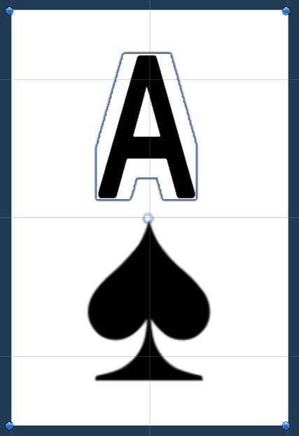
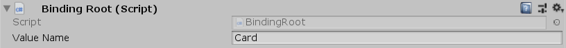
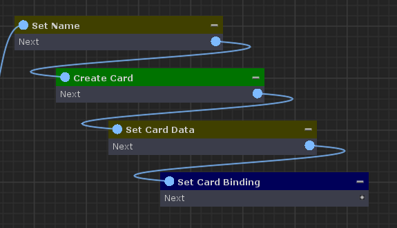
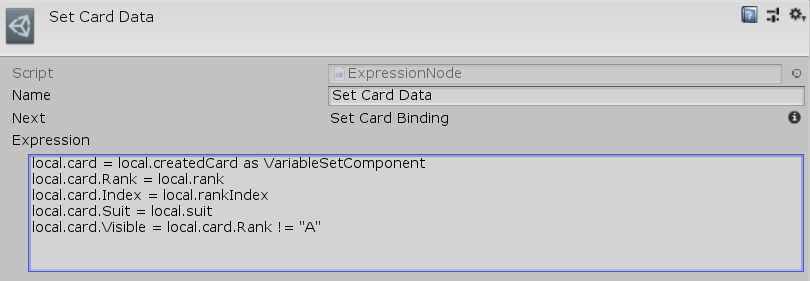
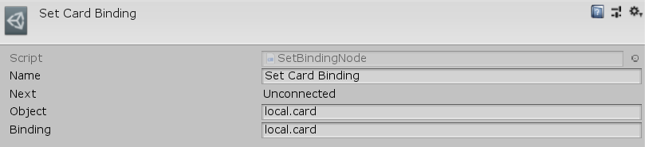
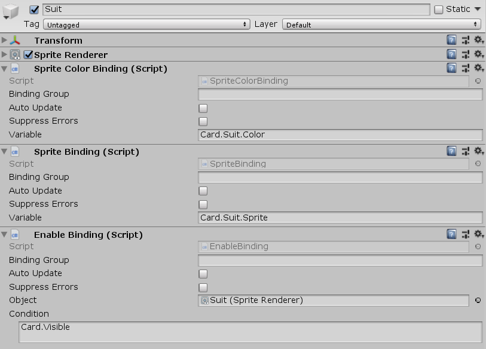
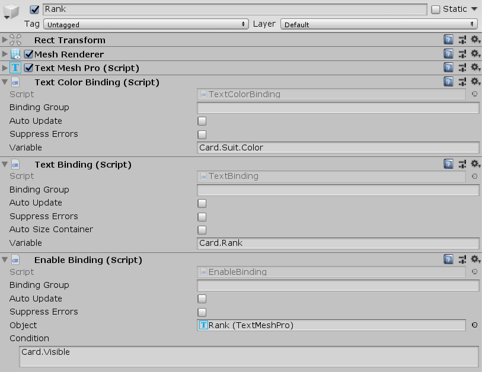

[#topics/bindings/binding-roots]

## Binding Roots

A Binding Root is a https://docs.unity3d.com/ScriptReference/MonoBehaviour.html[MonoBehaviour^] that acts as a variable root for all child objects with a Variable Binding. Each binding root contains the <<topics/variables/overview.html,variable>> _Value_ that child bindings access via the _ValueName_ property. Binding roots are hierachical and variable bindings have access to every binding root in its hierarchy as long as each root has a differet _ValueName_. In addition variables can be looked up on the <<manual/composition-manager.html,Composition Manager>>'s `"global"` and `"scene"` <<reference/i-variable-store.html,IVariableStores>> (detailed in <<topics/variables/accessing-variables.html,Accessing Variables>>). A binding root's _Value_ can be set in two ways: from a derived class such as <<manual/object-binding-root.html,Object Binding Root>> (detailed in <<topics/bindings/custom-binding-roots.html,Creating Custom Binding Roots>>) or through a <<manual/set-binding-node.html,Set Binding Node>>. Take the following example of the Card prefab from the CardGame example:

The base object of the prefab has the above binding root behaviour attached. Notice that _Value Name_ is set to `"Card"`. This means that all child variable binding behaviours can access the variables of this binding root, through the variable `"Card"`. The variables available on this binding root are set up through the following set of nodes, ending with a <<manual/set-binding-node.html,Set Binding Node>>.

There are two child objects in the prefab, "Suit" and "Rank", each with multiple variable bindings behaviours attached. These use the variables set up in the graph above to set visual elements in the scene.

Notice that each binding uses `"Card"` to access the binding root's variables.