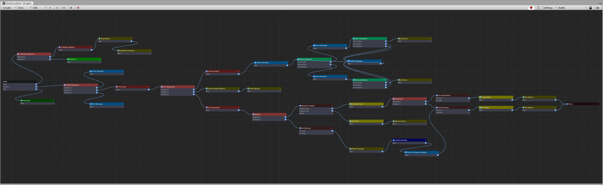

[#topics/graphs]

## Graphs

### Overview

Intruction Graphs are the main feature of the composition system. Graphs work similarly to flow chart. When run, they traverse a tree of nodes which each execute their own logic. Graphs can branch and loop based on variables, expressions, input, or any other custom logic. The power of graphs comes in the way they allowing timing and sequencing of game logic to occur. Whereas waiting on actions and events in script can be difficult to manage, graphs provide a simple to use visual interface for interacting with your game world to create things like, cutscenes, dialog trees, menus, scene transitions and even entire game systems, without the need to write lengthy scripts. The benefit of graphs is that they can work dynamically based on variables in your game world, with each graph able to perform different actions based on the object that is executing the graph and the inputs provided to it. Robust debugging is possible with breakpoints, runtime variable editing, and extensive error logging. In addition to supporting most of Unity's built in systems, graphs are also easily extensible to your own game logic by simply creating custom nodes which can then provide any desired functionality.

image:simple-graph.png[]
_An example of a simple graph that opens a door with a key_

_An example of a more complex graph that runs an entire turn based battle system_

### Workflow

Create a new graph in the Project window (menu:Create[PiRho Soft > Graphs]) Open the Instruction Graph Window by double clicking on a graph in the Project window or through the menu:Window[PiRho Soft > Instruction Graph] menu. Every graph starts with a single _"Start"_ node where execution of the graph begins. Selecting the start node will show the graph itself in the inspector where its properties can be edited (see Context/Inputs/Outputs). Create new nodes from the drop down in the top left of the window or by right clicking anywhere on the graph. When a node is selected its properties can be edited in the Inspector. In the graph view, each node will show its list of outputs that it can branch to. Create connections from these branches by clicking on the output knob and then the node you would like it to connect to. Many different connections can connect to the same node however, outputs can only connect to a single new node. When a graph reaches an output to a branch that has no connection the graph will end.

### Nodes

Nodes make up the bulk of the functionality of a graph. They may control both the flow of the graph and/or the behaviour that should be performed. For example, a <<manual/conditional-node.html, Conditional Node>> branches the graph based on the `true` or `false` value of an <<reference/expression.html,expression>> and has no effect on the game world, while a <<manual/message-node.html,Message Node>> physically displays a message in the game. The following is a list of built-in nodes by category:

|===
| Animation |

| <<manual/play-animation-node.html,Play Animation>> | Play an animation on a game object
| <<manual/play-animation-state-node.html,Play Animation State>> | Play an animation state on an Animator
| <<manual/set-animation-parameter- node.html,Set Animation Parameter>> | Set an animation parameter on an Animator
| <<manual/play-effect-node.html,Play Effect>> | Create and play an effect Prefab
| <<manual/play-sound-node.html,Play Sound>> | Play an AudioClip
| <<manual/play-timeline-node.html,Play Timeline>> | Run a timeline
|===

|===
| Composition |

| <<manual/expression-node.html,Expression>> | Run an expression
| <<manual/instruction-node.html,Instruction>> | Run an instruction
| <<manual/get-property-node.html,Get Property>> | Retreive and store a property on any Object
| <<manual/set-property-node.html,Set Property>> | Set a property on any Object
| <<manual/call-method-node.html,Call Method>> | Call a method on any Object
| <<manual/shuffle-node.html,Shuffle>> | Shuffle a variable list
| <<manual/sort-node.html,Sort>> | Sort a variable list
| <<manual/reset-tag-node.html,Reset Tag>> | Reset variables by tag
| <<manual/reset-variables-node.html,Reset Variables>> | Reset variables by name
|===

|===
| Control Flow |

| <<manual/conditional-node.html,Conditional>> | Fork the graph based on a condition
| <<manual/branch-node.html,Branch>> | Run a single branch based on a string value
| <<manual/sequence-node.html,Sequence>> | Run a list of nodes in order
| <<manual/loop-node.html,Loop>> | Loop until a condition is met
| <<manual/iterate-node.html,Iterate>> | Iterate the items in a variable list
| <<manual/break-node.html,Break>> | Break out of a loop
| <<manual/yield-node.html,Yield>> | Yield for a single frame
|===

|===
| Debug |

| <<manual/comment-node.html,Comment>> | Keep notes in the graph
| <<manual/log-node.html,Log>> | Log a message in the console
| <<manual/mockup-node.html,Mockup>> | For visual prototyping
|===

|===
| Interface |

| <<manual/message-node,Show Message>> | Show a message
| <<manual/selection-node,Show Selection>> | Show and wait for a selection
| <<manual/input-node,Input>> | Wait until a button is pressed
| <<manual/show-control-node,Show Control>> | Activate an interface control
| <<manual/hide-control-node,Hide Control>> | Hide an interface control
| <<manual/set-binding-node,Set Binding>> | Set the binding value for a binding root
| <<manual/update-binding-node,Update Binding>> | Tell a binding root to update its bindings
|===

|===
| Object Manipulation |

| <<manual/create-game-object-node.html,Create Game Object>> | Create a game object from a prefab
| <<manual/create-scriptable-object-node.html,Create Scriptable Object>> | Create a scriptable object
| <<manual/destroy-object-node.html,Destroy Object>> | Destroy an object
| <<manual/enable-object-node.html,Enable Object>> |
| <<manual/disable-object-node.html,Disable Object>> |
|===

|===
| Sequencing |

| <<manual/play-transition-node.html,Play Transition>> | Play a transition
| <<manual/clear-transition-node.html,Clear Transition>> | Stop the current transition
| <<manual/load-scene-node.html,Load Scene>> | Play a transition
| <<manual/unload-scene-node.html,Unload Scene>> | Play a transition
| <<manual/transform-node.html,Transform Object>> | Move or animate the transform of a game object
| <<manual/time-scale-node.html,Time Scale>> | Set the time scale value
| <<manual/wait-node.html,Wait>> | Wait for an amount of time
|===

In addition, custom nodes can be created (see Creating Custom Nodes).

### Control Flow - Branching, Sequences, and Loops

While most nodes simply perform an action and then move on to another node, some nodes alter the control flow of the graph, branching to different outputs, looping through its child nodes multiple times, or running a list of nodes in order.

#### Branching

Nodes that branch can have multiple output connections but will only traverse through a single connection. Through branching, graphs can have dynamic behaviour through different executions of a graph.

In the example above, imagine we run a graph for when player is attempting to open a locked door. If the player has the key we can branch to nodes that run the open animation, load the next scene, etc. If the player doesn't have the key we can branch to a different set of nodes that displays a message that says the door is locked.

#### Sequences

Nodes that implement the <<reference/i-sequence-node.html,ISequenceNode>> interface act as sequences. A sequence will cause the graph to continually return to this node until is does not have another node to run. For example, the <<manual/sequence-node.html,Sequence Node>> will branch to each one of it outputs in order. That is, when the first branch reaches the end of its execution (when it has no connections) the graph will revert back to the sequence and then run the next branch until all of branches have been run.

For example in the example above...

#### Loops

Nodes that loop implement the <<reference/i-loop-node.html,ILoopNode>> interface. Looping causes the graph to continually return to this node until it is says that it is done. For example, the <<manual/loop-node.html,Loop Node>> will continue to run through each of its child nodes until a condition is met. To preemtively break out of a loop, use a <<manual/break-node.html,Break Node>>. This will tell the graph to return to stop running the most recently executed <<reference/i-loop-node.html,ILoopNode>>.

In many cases once a loop has finish, it may be desired to continue to execute other nodes. Because they don't have a concept of what to continue to after they are finished executing, it is common to place a sequence node immediately prior to the loop (as shown in the example above) to continue execution.

### Instruction Store

Every graph is created with an <<reference/instruction-store.html,Instruction Store>>. The instruction store provides access to all the <<referenece/variable-value.html,variables>> that nodes in the graph can access through <<reference/variable-reference.html,variable references>> and <<reference/expressions.html,expressions>> (see ___ for more info). The graph's instruction store provides access to the following variables by string name:

|===
| Name | Description

| `global` | The global variables stored on the <<manual/composition-manager.html,Composition Manager>>
| `local` | A pool of temporary values created and accessible only by nodes in this graph 
| `scene` | GameObjects by name in the loaded scenes (detailed in ___) 
| `input` | Values passed into this graph by the instruction caller (detailed below)
| `output` | Values returned by this graph to the instruction caller (detailed below)
|===

#### Context/Inputs/Outputs

In addition to the values above, each instruction store has a context object that is passed in by the script that ran the instruction. Select a graph in the Project window or click on the graph's start node to select it in the Inpector. Here a graph's context object, inputs, and outputs can be viewed. The context object is accessed by the string enterred as the _ContextName_ property. By default the context object can be of any type stored in a <<reference/variable-value.html,variable value>>. With the _ContextDefinition_ property this value can be defined as a certain type and constrained to any desired parameters. When run, the graph will assert that the given context object is of the correct type and constrained correctly. If it is an object type, it will be automatically cast to the defined type.

image:context-input-output-example.png[]

Graphs may have input values that are passed in by the calling object and output values that are subsequently returned to the calling object, similar to parameters and return values of methods in script. Inputs and Outputs are automatically retrieved from each node in the graph that potentially needs them. Consider the following <<manual/expression-node.html,expression-node.html>>:

image:input-output-example.png[]
output.Foo = input.Bar * 2;

The variable _Foo_ will be automatically added to the graph's output list and the variable _Bar_ will be auto added to its inputs. However since an expression contains no type information, like the context, these variables may have types and constraints defined for them on the graph's list of inputs and outputs. They will also automatically appear in the inspector of an <<reference/instruction-caller.html>> (see Running Graphs From Script) that will run this graph. The instruction caller is where the actual values of what is passed into the graph are defined.

### Debugging

Robust runtime debugging tools are provided to help find errors, profile performance, and inspect values of graphs while they are running. Place breakpoints on individual nodes using the red button on the left side of the Instruction Graph Window's toolbar. Execution will pause when a node with a break point is reached. Playback of the graph can then be controlled using the play, pause, step, and stop buttons. Use the logging button (the paper icon on the right side of the toolbar) to track flow of the graph in the console.

image:debuging.png[]

Use the Watch Window (menu:Window[PiRho Soft > Watch Window]) to inspect and edit variables on graph's instruction store while it is running. Use the dropdown at the top and type in the path to a variable store or click on the inspect button to the right of a variable store to add it to the watch list. Use the text box at the bottom of the watch window to run an expression.

### Running Graphs From Script

Running graphs from script is as simple as calling `CompositionManager.Instance.RunInstruction()`.

IMPORTANT: When storing a graph that will be serialized on an object it is important to define it as a <<reference/instruction-caller.html,InstructionStore>> instead of a standard instruction. This will ensure that inputs and outputs on the referenced graph are read and written correctly.

The following example will run a graph when its object is loaded:
[source,cs]
----
	public class RunGraph : MonoBehaviour
	{
		public InstructionCaller Graph = new InstructionCaller(); <1>

		void Start()
		{
			if (Graph.Instruction && !Graph.IsRunning) <2>
				CompositionManager.Instance.RunInstruction(Graph, CompositionManager.Instance.DefaultStore, VariableValue.Create(this)); <3>
		}
	}
----

<1> The graph to run - notice this is an <<reference/instruction-caller.html,InstructionCaller>>
<2> Make sure to check if the caller's instruction is set and not already running from another process
<3> Passes the <<manual/composition-manager.html,Composition Manager>>'s default store to use for references to inputs and outputs (second parameter) and `this` as the graph's context object (third parameter)

See <<manual/instruction-trigger.html,Instruction Trigger>> and its derived classes for other examples of running graphs from script.

### Creating Custom Graphs

To create a custom graph, derive from <<reference/instruction-graph.html,InstructionGraph>> and implement the abstract method `Run(InstructionStore variables)`. The following is an example of a graph that has three different entry points and runs them sequentially:

[source,cs]
----
	public class ScopedGraph : InstructionGraph
	{
		<1>
		public InstructionGraphNode Enter = null;
		public InstructionGraphNode Process = null;
		public InstructionGraphNode Exit = null;

		protected override IEnumerator Run(InstructionStore variables)
		{
			<2>
			yield return Run(variables, Enter, nameof(Enter));
			yield return Run(variables, Process, nameof(Process));
			yield return Run(variables, Exit, nameof(Exit));
		}
	}
----

<1> <<reference/intruction-graph-node.html,InstructionGraphNode>> fields on a graph will automatically be added as output options visually for a graph in the Instruction Graph Window.

<2> Internally, graphs operate as a https://docs.unity3d.com/ScriptReference/Coroutine.html[Coroutine^] which gives fine control of timing behaviour. Because of this, it is important to `yield` the execution of each entry node that this graph will run. The third parameter is simply a label used in debugging for tracking the flow of execution in the Instruction Graph Window.

Ultimately, graphs are just a https://docs.unity3d.com/ScriptReference/ScriptableObject.html[Asset^] so they can store data and implement any functionality desired. Execution will end when the `Run()` function finishes.

### Creating Custom Nodes

To create custom nodes, derive from <<reference/instruciton-graph-node.html,InstructionGraphNode>> and implement the abstract method `Run(InstructionGraph graph, InstructionStore variables, int iteration)`

[source,cs]
----
	public class SpawnObjectNode : InstructionGraphNode
	{
		public InstructionGraphNode Next = null; <1>
		public GameObjectVariableSource Prefab = new GameObjectVariableSource();
		public VariableReference ObjectVariable = new VariableReference();
		
		public override IEnumerator Run(InstructionGraph graph, InstructionStore variables, int iteration) <2>
		{
			if (ResolveObject(variables, Prefab, out GameObject prefab)) <3>
			{
				var spawned = Instantiate(prefab);

				Assign(variables, ObjectVariable, VariableValue.Create(spawned)); <4>
			}

			graph.GoTo(Next, nameof(Next)); <5>

			yield break;
		}
	}
	
----

<1> <<reference/intruction-graph-node.html,InstructionGraphNode>> fields on a node will automatically be added as branch options for that node in Instruction Graph Window.
<2> The third parameter _iteration_ will increment if this node is an <<reference/i-sequence-node.html,ISequenceNode>> or an <<reference/i-loop-node.html,ILoopNode>> every time this node is run.
<3> Numerous `Resolve()` helper methods are provided on the base <<reference/instruction-graph-node.html,InstructionGraphNode>> class to simplify retrieving typed objects from <<reference/variable-reference.html,variable references>> and <<reference/variable-source,variable sources>>.
<4> The `Assign()` helper method is also provided for setting <<reference/variable-value,values>> to <<reference/variable-reference,references>>
<5> Call `graph.GoTo()` to tell the graph that this node has finished performing its actions. If the passed node is `null`, or if `graph.GoTo()` is not called before the run method finishes, then the graph will finish. The second parameter is simply a label used in debugging for tracking the flow execution in the Instruction Graph Window