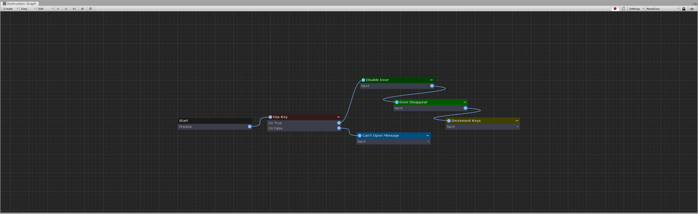
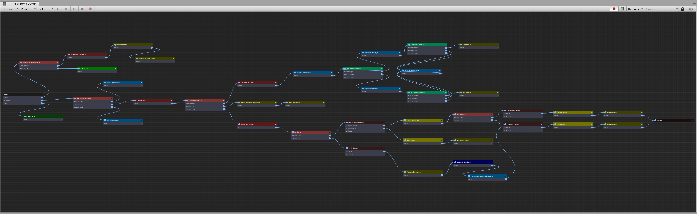

[#topics/graphs-1]

## Graphs

### Overview

Intruction Graphs are the main feature of the composition system. Graphs work similarly to flow chart. When run, they traverse a tree of nodes which each execute their own logic. Graphs can branch and loop based on variables, expressions, input, or any other custom logic. The power of graphs comes in the way they allowing timing and sequencing of game logic to occur. Whereas waiting on actions and events in script can be difficult to manage, graphs provide a simple to use visual interface for interacting with your game world to create things like, cutscenes, dialog trees, menus, scene transitions and even entire game systems, without the need to write lengthy scripts. The benefit of graphs is that they can work dynamically based on variables in your game world (see <<topics/variables-1.html,Variables>>), with each graph able to perform different actions based on the object that is executing the graph and the inputs provided to it. Robust debugging is possible with breakpoints, runtime variable editing, and extensive error logging. In addition to supporting most of Unity's built in systems, graphs are also easily extensible to your own game logic by simply creating custom nodes which can then provide any desired functionality.

_An example of a simple graph that opens a door with a key_

_An example of a more complex graph that runs an entire turn based battle system_

### Workflow

Create a new graph in the Project window (menu:Create[PiRho Soft > Graphs]) Open the Instruction Graph Window by double clicking on a graph in the Project window or through the menu:Window[PiRho Soft > Instruction Graph] menu. Every graph starts with a single _"Start"_ node where execution of the graph begins. Selecting the start node will show the graph itself in the inspector where its properties can be edited (see <<topics/graphs-4.html,Context/Inputs/Outputs>>). Create new nodes from the drop down in the top left of the window or by right clicking anywhere on the graph. When a node is selected its properties can be edited in the Inspector. In the graph view, each node will show its list of outputs that it can branch to. Create connections from these branches by clicking on the output knob and then the node you would like it to connect to. Many different connections can connect to the same node however, outputs can only connect to a single new node. When a graph reaches an output to a branch that has no connection the graph will end.
