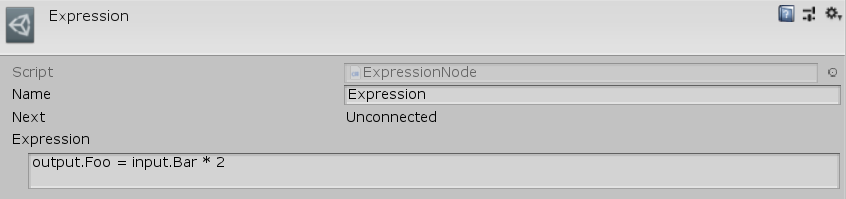

[#topics/graphs-4]

## Graphs

### Instruction Store

Every graph is created with an <<reference/instruction-store.html,Instruction Store>>. The instruction store provides access to all the <<referenece/variable-value.html,variables>> that nodes in the graph can access through <<reference/variable-reference.html,variable references>> and <<reference/expressions.html,expressions>> (see ___ for more info). The graph's instruction store provides access to the following variables by string name:

|===
| Name | Description

| `global` | The global variables stored on the <<manual/composition-manager.html,Composition Manager>>
| `local` | A pool of temporary values created and accessible only by nodes in this graph 
| `scene` | GameObjects by name in the loaded scenes (detailed in ___) 
| `input` | Values passed into this graph by the instruction caller (detailed below)
| `output` | Values returned by this graph to the instruction caller (detailed below)
|===

#### Context/Inputs/Outputs

In addition to the values above, each instruction store has a context object that is passed in by the script that ran the instruction. Select a graph in the Project window or click on the graph's start node to select it in the Inpector. Here a graph's context object, inputs, and outputs can be viewed. The context object is accessed by the string enterred as the _ContextName_ property. By default the context object can be of any type stored in a <<reference/variable-value.html,variable value>>. With the _ContextDefinition_ property this value can be defined as a certain type and constrained to any desired parameters. When run, the graph will assert that the given context object is of the correct type and constrained correctly. If it is an object type, it will be automatically cast to the defined type.

image:context-input-output-example.png[]

Graphs may have input values that are passed in by the calling object and output values that are subsequently returned to the calling object, similar to parameters and return values of methods in script. Inputs and Outputs are automatically retrieved from each node in the graph that potentially needs them. Consider the following <<manual/expression-node.html,expression-node.html>>:

output.Foo = input.Bar * 2;

The variable _Foo_ will be automatically added to the graph's output list and the variable _Bar_ will be auto added to its inputs. However since an expression contains no type information, like the context, these variables may have types and constraints defined for them on the graph's list of inputs and outputs. They will also automatically appear in the inspector of an <<reference/instruction-caller.html>> (see Running Graphs From Script) that will run this graph. The instruction caller is where the actual values of what is passed into the graph are defined.
