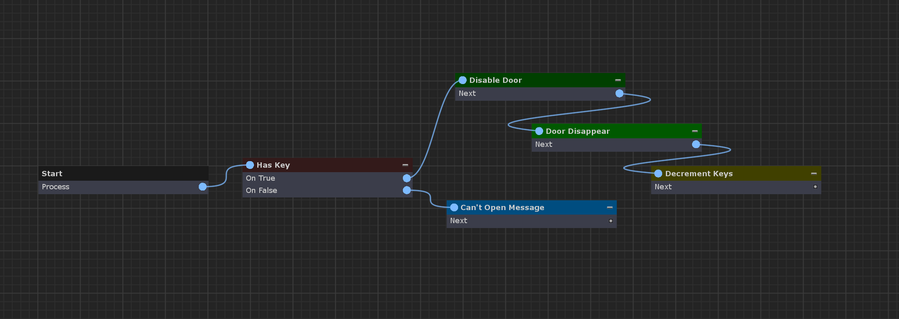
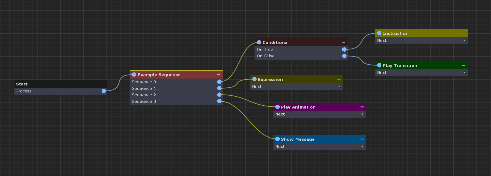
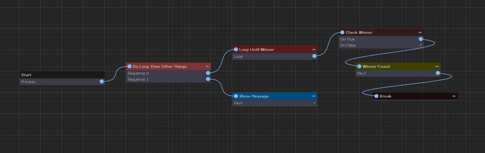

[#topics/graphs-3]

## Control Flow

While most nodes simply perform an action and then move on to another node, some nodes alter the control flow of the graph, branching to different outputs, looping through its child nodes multiple times, or running a list of nodes in order.

### Branching

Nodes that branch can have multiple output connections but will only traverse through a single connection. Through branching, graphs can have dynamic behaviour in different executions of a graph.

In the example above, imagine we run a graph for when player is attempting to open a locked door. If the player has the key we can branch to nodes that run the open animation, load the next scene, etc. If the player doesn't have the key we can branch to a different set of nodes that displays a message that says the door is locked.

### Sequences

Nodes that implement the <<reference/i-sequence-node.html,ISequenceNode>> interface act as sequences. A sequence will cause the graph to continually return to this node until is does not have another node to run. For example, the <<manual/sequence-node.html,Sequence Node>> will branch to each one of it outputs in order. That is, when the first branch reaches the end of its execution (when it has no connections) the graph will revert back to the sequence and then run the next branch until all of branches have been run.

For example in the example above each of the four branches of the sequence will run in order (from top to bottom) before the graph ends

### Loops

Nodes that loop implement the <<reference/i-loop-node.html,ILoopNode>> interface. Looping causes the graph to continually return to this node until it is says that it is done. 

In this example, the <<manual/loop-node.html,Loop Node>> will continue to run through each of its child nodes until a condition is met. To preemptively break out of a loop, use a <<manual/break-node.html,Break Node>>. This will tell the graph to stop running the most recently executed <<reference/i-loop-node.html,ILoopNode>>. In many cases once a loop has finished, it may be desired to continue executing other nodes. Because loop nodes don't have a concept of where to continue after they are finished executing, it is common to place a sequence node immediately prior to the loop (as shown in the example above) to continue execution. Additionally an <<manual/exit-node.html,Exit Node>> may be used to break out of all loops and sequences.
