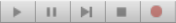
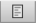
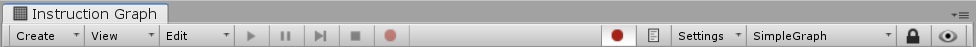
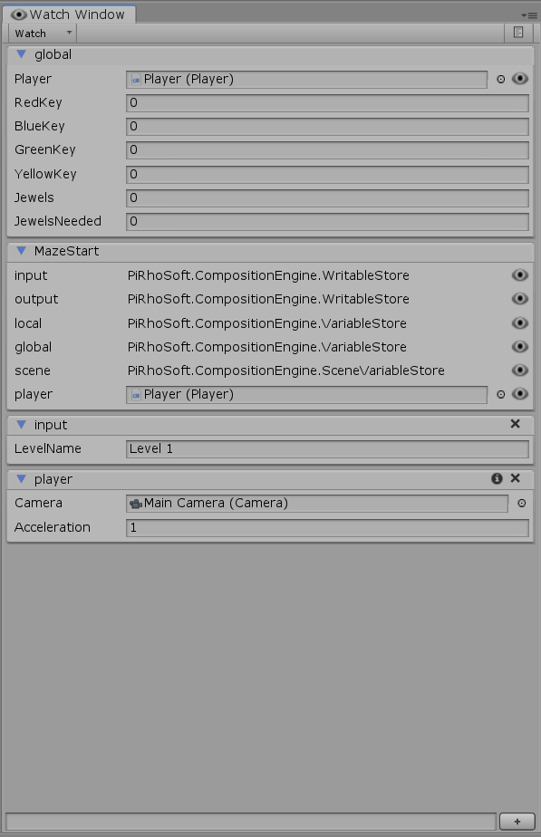

[#topics/graphs-5]

## Debugging

Robust runtime debugging tools are provided to help find errors, profile performance, and inspect values of graphs while they are running. Place breakpoints on individual nodes using the red button on the left side of the Instruction Graph Window's toolbar. Execution will pause when a node with a break point is reached. Playback of the graph can then be controlled using the play, pause, step, and stop buttons . Use the logging button  to track flow of the graph in the console.

Use the Watch Window (menu:Window[PiRho Soft > Watch Window]) to inspect and edit variables on graph's instruction store while it is running. Use the dropdown at the top and type in the path to a variable store or click on the inspect button to the right of a variable store to add it to the watch list. Use the text box at the bottom of the watch window to run an expression.

