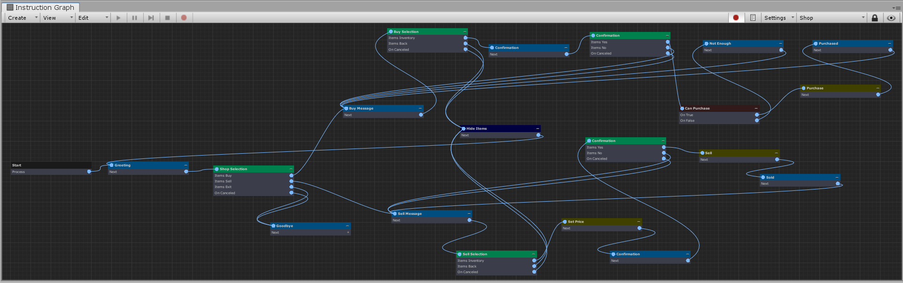
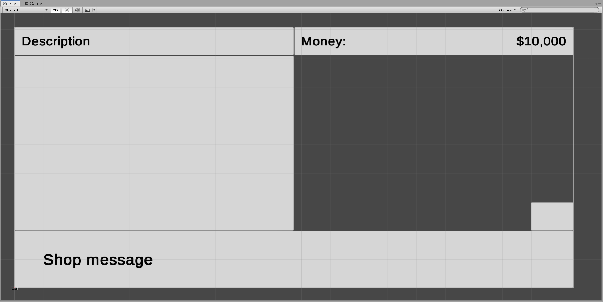

[#topics/interface/overview]

## Overview

The interface system is used in conjunction with https://docs.unity3d.com/Manual/UISystem.html[Unity's UI^] system make creating and interacting with common UI elements in a game much simpler. Interfaces work with <<manual/graphs-1.html,graphs>> for sequencing things like dialogs, selections, menus, etc, without the need for scripting. The main components of the interface system are Interface Controls. These are activated and deactivated from graphs and control the behaviour of UI elements in the scene. Messages and Selections are the two built in controls provided. Interface controls are designed with extensibility in mind; each can be customized for desired behaviour and other custom controls can be created.

### Workflow

The following is an example of a <<topics/graphs/overview.html,graph>> the defines a dialog sequence constructed almost entirely of <<manual/message-node.html,Message Nodes>> and <<manual/selection-node.html,Selection Nodes>> to create a shop.

And the scene it references which has a <<manual/message-control.html,Message>> controlling the text at the bottom, and <<manual/selection-control.html,Selection Controls>> controlling the selection boxes on the sides.

See the _"Shop"_ scene in the Shop project to view this example.

### Topics

. <<topics/interface/controls,Controls>>
. <<topics/interface/messages,Messages>>
. <<topics/interface/menus-and-selections,Menus and Selections>>