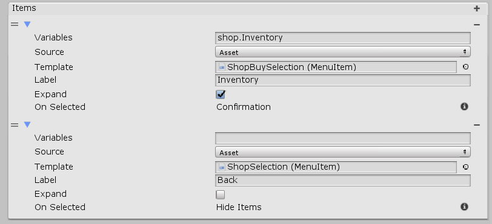

[#topics/interface/menus-and-selections]

## Menus

Menus are https://docs.unity3d.com/ScriptReference/MonoBehaviour.html[MonoBehaviours^] that provide an interface for adding, removing, selecting, and focusing of child https://docs.unity3d.com/ScriptReference/GameObject.html[GameObjects^]. On their own, Menus are simply a container for child <<manual/menu-item.html,Menu Items>> which are created externally. The can be created manually in the editor or populated automatically using a <<manual/list-binding.html,List Binding>> or in conjunction with a <<manual/selection-control.html,Selection Control>> and a <<manual/selection-node.html,Selection Node>>.

### Selection Controls

Selection Controls are <<manual/interface-control.html,Interface Controls>> used to dynamically populate a menu with items to be selected from when promted. Selection Controls activated with the `Show()` method which takes a list of <<reference/menu-item-template.html,MenuItemTemplates>>. Each template contains the info needed to create items in the menu: a name, the <<topics/variables/overview,variables>> to assign to the item, the prefab to instantiate, etc. Selection controls can optionally require a selection to made so they cannot be cancelled, and they can optionally maintain their focused index in case the selection is being returned to from a subsequent menu.

### Menu Items

A Menu Item component must be attached to each object in a menu, whether it be a prefab to be instantiated or an existing item in the scene. They are a <<topics/bindings/binding-roots,binding root>> which exposes an _ItemName_ field which gives access to the data of the Menu Item itself. Variables that can be accessed by child <<topics/bindings/variable-bindings.html,bindings>> through _ItemName_ are: _Index_, _Column_, _Row_, _Label_, and _Focused_. The _ValueName_ field on a menu item expossed the variables specified by the menu item template used to create the menu item.

### Selection Nodes

Create a Selection Node in a <<topics/graphs/overview.html,graph>> using the menu:Create[Interface > Selection] menu of the Instruction Graph Window. A Selection Node will activate a selection control and give it a list of <<reference/menu-item-template.html,MenuItemTemplates>> to create. A Selection Node will deactivate the control once a selection has been made if _AutoHide_ is `true`. If _AutoHide_ is `false` then a <<manual/hide-control-node.html,Hide Control Node>> must be used to deactivate it. When a selection is made the selected item and index will be assigned to <<reference/variables-referenece.html,variables>> specified by _SelectedItem_ and _SelectedIndex_. The graph will then branch to the corresponding node of the <<reference/selection-node-item.html,selected item>>. Selection Nodes tell the selection control via the _IsSelectionRequired_ flag whether it can be cancelled or not. If this is the first iteration of the selection node then it will also tell the selection control to reset its focus.

### Menu Item Templates

Each item will be created from a Menu Item Template which has the following properties:

[cols="1,2"]
|===
| Name	| Description

| Variables	| The variable that should be used as the <<manual/binding-root.html,Binding Root>> _Value_ for the menu item.
| Source	| Specifies whether the menu item should be looked up in the scene using _Name_ (`Scene`) or created from a https://docs.unity3d.com/Manual/Prefabs.html[prefab^] using _Template_ (`Asset`)
| Name	| When _Source_ is `Name`, the name of the https://docs.unity3d.com/Manual/GameObject.html[GameObject^] containing the menu item in the loaded scenes.
| Template	| When _Source_ is `Asset`, the https://docs.unity3d.com/Manual/Prefabs.html[prefab^] to create the menu item from.
| Label	| When _Source_ is `Asset`, the label to assign to the menu item
| Expand	| When _Source_ is `Asset`, this is `true`, and _Variables_ references a <<reference/variable-type.html,List>>, a menu item will be created from _Template_ for each item in the list
|===

### Other Helpful Behaviours

#### Menu Input

In order to maintain modularity of behaviours, responding to input in menus should be done with separate components. Use a <<manual/menu-input.html,Menu Input>> component to handle the behaviour of input, focusing, selecting, and scrolling, through menu items.

#### Focus Binding Root

Use a Focus Binding Root to bind data to the currently focused menu item in a menu. This can be useful for displaying information like a description of an item in separate UI objects that are not actually part of the selection. See the _"Shop"_ scene for an example.
