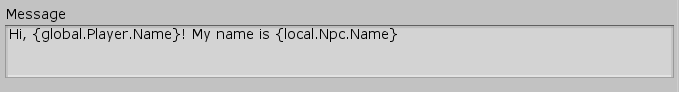

[#topics/interface-3]

## Message Controls

Message Controls are an <<manual/interface-control.html,Interface Control>> used to show a <<reference/message.html,message>>, on a http://digitalnativestudios.com/textmeshpro/docs/[TextMeshPro^] component. Use a <<manual/message-node.html,Message Node>> to activate a message control and  a <<manual/message-input.html,Message Input>> behaviour to advance the text with input. When shown a message controls starts a https://docs.unity3d.com/ScriptReference/Coroutine.html[Coroutine^] that will run until the message is finished. Utilizing this coroutine, custom messages can be implemented to show certain pages that advance with input, scrolling, letter by letter typewniting, etc. A <<manual/message-node.html,Message Node>> may also optionally wait for the message to complete before moving on to subsequent nodes. A message control's _IsRunning_ flag will be set from when it is shown to when it is finished.

### Message Node

Create a Message Node in a <<topics/graphs-1.html,graph>> using the menu:Create[Interface > Message] menu of the Instruction Graph Window. A Message Node will activate a message control, which enables the referenced http://digitalnativestudios.com/textmeshpro/docs/[TextMeshPro^] component and set its text to a resolved <<reference/message.html,Message>>. The node can automacally deactivate message control when it is finished is complete if _AutoHide_ is `true`. If _AutoHide_ is `false` then a <<manual/hide-control-node.html,Hide Control Node>> must be used to deactivate it. Message nodes can also delay the amount of time to wait before they deactivate the message control with the _WaitTime_ field.

image::message-node-example.png[]

### Message

A <<reference/message.html,message>> is the string that will be displayed and can be dynamically formatted using <<topics/variables-1.html,variables>>. To add formatted variables insert a variable reference between braces (`{}`). For example in following message:

The variables `global.Player.Name` and `local.Npc.Name` will be resolved at runtime with the <<topics/graphs-4.html,instruction store>> on the message node, and the message control will display the text accordingly (provided those variables exist). Variables that are not strings will have `.ToString()` called on them so numbers can be displayed as well.

### Input

In order to maintain modularity of behaviours, responding to input in message controls should be done with separate components. Use a <<manual/message-input.html,Message Input>> component to wait for the specified button, _AcceptButton_ to be pressed to finish a message.

### Custom Message Nodes

The Message Control provides basic functionality for displaying text, however, most games display messages with much more custom behaviour. Message controls are designed to be extensible desired behaviour can be achieved with little difficulty. The following example shows how to derive from <<manual/message-control.html,Message Control>> to create a paged, typewriter-like effect that responds to two button presses - to fast forward, and to advance:

[source,css]
----
	public class TypewriterControl : MessageControl
	{
		public float CharactersPerSecond = 25.0f;
		
		[NonSerialized]
		public bool FastForward = false;

		protected override IEnumerator Run()
		{
			DisplayText.maxVisibleCharacters = 0;

			yield return null; // consume the press that opened the message

			for (var page = 0; page < DisplayText.textInfo.pageCount; page++)
			{
				yield return ShowPage(page);

				IsAdvancing = false;

				while (!IsAdvancing)
					yield return null;
			}

			yield return null;
		}
	
		private IEnumerator ShowPage(int index)
		{
			var page = DisplayText.textInfo.pageInfo[index];
			var characterCount = page.lastCharacterIndex - page.firstCharacterIndex + 1;
			var characterDelay = CharactersPerSecond <= 0.0f ? 0.0f : 1.0f / CharactersPerSecond;
			var delay = characterDelay;

			DisplayText.maxVisibleCharacters = page.firstCharacterIndex;
			DisplayText.pageToDisplay = index + 1;
	
			while (DisplayText.maxVisibleCharacters < characterCount)
			{
				if (FastForward)
				{
					// fast forward to the end of the text (one character per frame)
					characterDelay = 0.0f;
					delay = 0.0f;
				}
				else if (IsAdvancing)
				{
					// skip to the end of the page
					DisplayText.maxVisibleCharacters = characterCount;
				}
				else if (delay <= 0.0f)
				{
					delay += characterDelay;
					DisplayText.maxVisibleCharacters++;
				}
	
				delay -= Time.deltaTime;

				yield return null;
			}
		}
	}

	public class TypewriterInput : MonoBehaviour
	{
		public string FastForwardButton = "Cancel";
		public string NextButton = "Submit";

		private TypewriterControl _typewriter;

		void Awake()
		{
			_typewriter = GetComponent<TypewriterControl>();
		}

		void Update()
		{
			_typewriter.FastForward = InputHelper.GetButtonDown(FastForwardButton);

			if (InputHelper.GetWasButtonPressed(NextButton))
				_typewriter.Advance();
		}
	}
----

Simply override the `Run()` method and implement your custom behaviour. Notice how `Run()` returns an https://docs.microsoft.com/en-us/dotnet/api/system.collections.ienumerator?view=netframework-4.80[IEnumerator^]. As mentioned before, this is because message controls are implemented as a https://docs.unity3d.com/ScriptReference/Coroutine.html[Coroutine^]. When the method ends _IsRunning_ will be set to `false`.