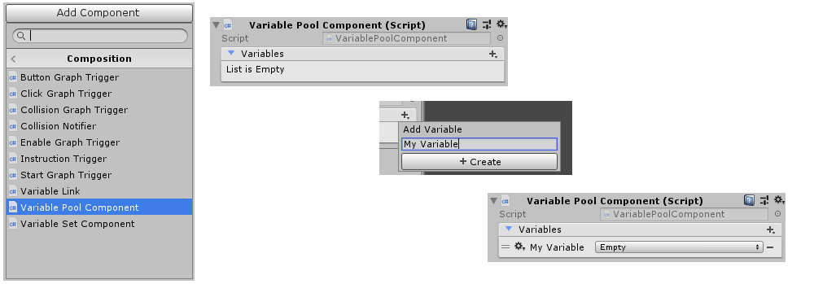
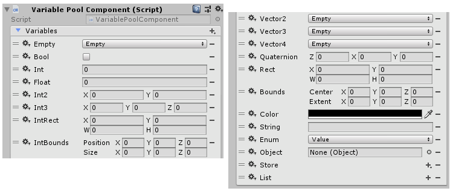
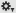
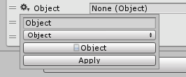
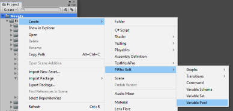

[#topics/variables-2]

## Variables

### Creating Variables

All variables exist in a Variable Store, often referred to as just _store_. Four Unity objects are included that can be used as stores:

|===
|							| Type				| Purpose

| Variable Pool Component	| https://docs.unity3d.com/ScriptReference/MonoBehaviour.html[Mono Behaviour^]	| Variables are defined and edited directly in the https://docs.unity3d.com/Manual/UsingTheInspector.html[inspector^]
| Variable Pool Asset		| https://docs.unity3d.com/ScriptReference/ScriptableObject.html[Scriptable Object^]	| Variables are defined and edited directly in the https://docs.unity3d.com/Manual/UsingTheInspector.html[inspector^]
| Variable Set Component	| https://docs.unity3d.com/ScriptReference/MonoBehaviour.html[Mono Behaviour^]	| Variables are edited in the https://docs.unity3d.com/Manual/UsingTheInspector.html[inspector^] and defined by a Variable Schema
| Variable Set Asset		| https://docs.unity3d.com/ScriptReference/ScriptableObject.html[Scriptable Object^]	| Variables are edited in the https://docs.unity3d.com/Manual/UsingTheInspector.html[inspector^] and defined by a Variable Schema
|===

The simplest of these is the Variable Pool Component.

This is created like any other https://docs.unity3d.com/Manual/UsingComponents.html[Component^] and can be found in the _Add Component_ menu under menu:PiRho Soft[Composition > Variable Pool Component]. Variables are added to the component with the  button in the upper right of the _Variables_ list. Clicking the button will open a popup where the name of the variable is entered. After clicking _Create_, the variable will be added to the store where it can be edited. Before setting a value for the variable, the type must be specified by selecting a type from the drop down list. The available types are:

|===
|				| Description

| Empty			| No value has been set
| Bool			| The value can be either `true` or `false`
| Int			| The value is an integer number
| Float			| The value is a decimal number
| Int2			| The value is a https://docs.unity3d.com/ScriptReference/Vector2Int.html[Vector2Int^]
| Int3			| The value is a https://docs.unity3d.com/ScriptReference/Vector3Int.html[Vector3Int^]
| IntRect		| The value is a https://docs.unity3d.com/ScriptReference/RectInt.html[RectInt^]
| IntBounds		| The value is a https://docs.unity3d.com/ScriptReference/BoundsInt.html[BoundsInt^]
| Vector2		| The value is a https://docs.unity3d.com/ScriptReference/Vector2.html[Vector2^]
| Vector3		| The value is a https://docs.unity3d.com/ScriptReference/Vector3.html[Vector3^]
| Vector4		| The value is a https://docs.unity3d.com/ScriptReference/Vector4.html[Vector4^]
| Quaternion	| The value is a https://docs.unity3d.com/ScriptReference/Quaternion.html[Quaternion^]
| Rect			| The value is a https://docs.unity3d.com/ScriptReference/Rect.html[Rect^]
| Bounds		| The value is a https://docs.unity3d.com/ScriptReference/Bounds.html[Bounds^]
| Color			| The value is a https://docs.unity3d.com/ScriptReference/Color.html[Color^]
| String		| The value is a text string
| Enum			| The value is an enum of a type defined in code (Enum values must be constrained)
| Object		| The value is an https://docs.unity3d.com/ScriptReference/Object.html[Object^]
| Store			| The value is a Variable Store (this cannot be set in the inspector however Variable Stores can be assigned as Objects)
| List			| The value is a list of other values
|===

Variables can be reordered by clicking and dragging the  to the left of each, removed by clicking the  to the right, or have their type changed using the  menu. Also in the  menu, some types can have a constraint specified to restrict the value the variable can hold. The types that can be constrained are:

|===
|				| Description

| Int			| The number must be between a minimum and maximum value
| Float			| The number must be between a minimum and maximum value
| String		| The value is selected from a list
| Enum			| The value is from a specific enum type defined in code (Enum values must be constrained)
| Object		| The object must be a specific object ype
| Store			| The store holds values defined in a Variable Schema (described in the <<topics/variables-3.html,next section>>)
| List			| The list holds values of a specific type
|===

A Variable Pool Asset is edited and used the same as a Variable Pool Component, however it is created as an asset using the https://docs.unity3d.com/Manual/ProjectView.html[project window^] rather than being added to a Game Object as a Component. It is located in the _Create_ menu under menu:PiRho Soft[Variable Pool]

If a set of variables is reused across many objects Variable Set Component should be used instead of Variable Pool Component and Variable Set Asset should be used instead of Variable Pool Asset. These objects use a Variable Schema to define the variables they contain thus eliminating the need to define them individually on each object or update every object to add or remove a variable. These are explained in the <<topics/variables-3.html,next section>>.
