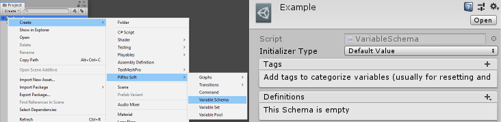
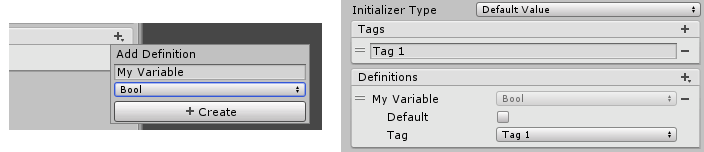
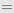
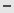
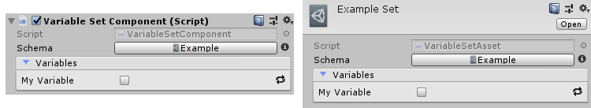

[#topics/variables/defining-variables]

## Defining Variables

Variables are defined using a Variable Schema, often referred to as just _schema_. A schema is created in the https://docs.unity3d.com/Manual/ProjectView.html[project window^] using the _Create_ menu and found under menu:PiRho Soft[Variable Schema].

A Variable Schema holds a set of Variable Definitions which describe the type and constraint for values in stores that use the schema. In addition, an _Initializer Type_ can be specified for each definition that will set the value of a variable when it is first created or reset. The possible settings for _Initializer Type_ are:

|===
|				| Description

| None			| The variable is set to the default value for its type
| Default Value	| The variable is set to an exact value
| Expression	| The variable is set to the result of an Expression (described in <<topics/variables/writing-expressions.html,Writing Expressions>>)
|===

The schema can also define a list of _Tags_. Each definition in the schema can then select one of these tags as a grouping mechanism to be used for <<manual/reset-tag-node.html,resetting the values>>.

The definitions themselves are added to the _Definitions_ list.

The + button will open a popup where the name, type, and constraint of the definition is specified. Once a definition is added, the _Initializer_ or _Default_ (depending on the schema's _Initializer Type_ setting) can be specified as well as the _Tag_ (if the schema has defined any in _Tags_). The definitions can be reordered using the  handle or removed using the  button.

Once a schema has been created, it can be used as a constraint for variables defined with type `Store`, or with Variable Set Component and Variable Set Asset. These are similar to the corresponding <<topics/variables/creating-variables.html,Variable Pool Component and Variable Pool Asset>> except instead of adding the variables directly to the object, they are automatically added by selecting a schema.

Editing a Variable Set is very straight forward. Select the _Schema_ to use, which will then populate the _Variables_ list. The value of each variable can then be edited dependending on the type and constraint defined by the schema. If the schema is edited, the _Variables_ list will be updated to reflect any changes, preserving any values that have already been set. If the selected _Schema_ changes, the _Variables_ list will be repopulated.
