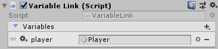
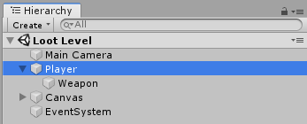

[#topics/variables-4]

## Accessing Variables

Once a set of variables has been defined and created in stores, they can now be accessed and used by other objects. Objects that use variables to control their functionality will have Variable References and Expressions exposed as a way to specify the variable they should access. Variable References, which refer to a variable directly, are covered here. Expressions, which can use multiple variables to compute a value, are covered in the <<topics/variables-4.html,next section>>.

Most commonly Variable References are encountered as properties on <<topics/graphs-2.html,Graph Nodes>>. The documentation for the specific node will indicate the type of value it expects. <<topics/graphs-2.html,Graph Nodes>> resolve Variable References using an Instruction Store. The Instruction Store has the following Variable Stores exposed and available to Variable References:

|===
| Name		| Description

| input		| predefined variables that are sent to the graph when it is run (detailed in <<topics/graphs-4.html, Context Inputs and Outputs>>)
| output	| predefined variables that are returned from the graph (detailed in <<topics/graphs-4.html, Context Inputs and Outputs>>)
| local		| variables available only to the current graph that are not predefined or constrained in any way
| global	| variables available and shared everywhere that are not predefined or constrained in any way (detailed below)
| scene		| a special store that provides access to scene objects by name (detailed below)
|===

NOTE: Variable References used outside of <<topics/graphs-2.html,Graph Nodes>> may have a different set of stores exposed. The corresponding documentation will indicate what those are, but the `global` and `scene` stores will always be available.

Variable References are specified as a string and have a simple syntax. Basic references that refer to a variable in a store or specified with the store name, followed by a `'.'`, followed by the variable name. For example to reference a variable named `attack` on the `local` store the reference would be `local.attack`. Because variables can also be stores themselves, this syntax can be chained. For example, to access the `attack` variable on a `player` in the `global` store, the reference would be `global.player.attack`. To access the variables inside a variable with type `List`, brackets are used along with the index of the variable to access. For example if the `global` `player` has a list of `items`. The second item would be referenced with `global.player.items[1]` (note the indexes are 0 based so the second item is at index 1). A variable in a `List` could itself be a variable store, in which case the same chaining can be used. So if an item has a `name`, that `name` would be referenced with `global.player.items[1].name`. This chaining works with any combination of `List` and `Store` variables to any depth.

The final capability of Variable References is casting. If a Variable Reference is supposed to refer to a certain component type, but the available stores only have access to a sibling of that component, the component can be accessed with `as`. For example if the `items` of the `player` in the previous example are stored on a different component of type `Inventory` that is a sibling of the `player` component, the items would be referenced with `global.player as Inventory.items`. Note that `Inventory` in this case is the exact name of the Component type that is being looked up.

NOTE: Often Variable References to objects do not need to be cast as the code using the reference will perform the cast automatically. This is explained in more detail in the <<topics/graphs-4.html,Graph Inputs and Outputs>> section.

Several of the built in variable types can have properties of their value accessed using the same syntax as accessing a value on a store. Specifically, the following types have the listed values available:

|===
| Type			| Property	|

.2+| Int2		| `x`		| The value of `x` on the https://docs.unity3d.com/ScriptReference/Vector2Int.html[Vector2Int^]
 				| `y`		| The value of `y` on the https://docs.unity3d.com/ScriptReference/Vector2Int.html[Vector2Int^]
.3+| Int3		| `x`		| The value of `x` on the https://docs.unity3d.com/ScriptReference/Vector3Int.html[Vector3Int^]
 				| `y`		| The value of `y` on the https://docs.unity3d.com/ScriptReference/Vector3Int.html[Vector3Int^]
 				| `z`		| The value of `z` on the https://docs.unity3d.com/ScriptReference/Vector3Int.html[Vector3Int^]
.4+| IntRect	| 'x'		| The value of `x` on the https://docs.unity3d.com/ScriptReference/RectInt.html[RectInt^]
.				| 'y'		| The value of `y` on the https://docs.unity3d.com/ScriptReference/RectInt.html[RectInt^]
.				| 'w'		| The value of `width` on the https://docs.unity3d.com/ScriptReference/RectInt.html[RectInt^]
.				| 'h'		| The value of `height` on the https://docs.unity3d.com/ScriptReference/RectInt.html[RectInt^]
.6+| IntBounds	| 'x'		| The value of `x` on the https://docs.unity3d.com/ScriptReference/BoundsInt.html[BoundsInt^]
.				| 'y'		| The value of `y` on the https://docs.unity3d.com/ScriptReference/BoundsInt.html[BoundsInt^]
.				| 'z'		| The value of `z` on the https://docs.unity3d.com/ScriptReference/BoundsInt.html[BoundsInt^]
.				| 'w'		| The value of `size.x` on the https://docs.unity3d.com/ScriptReference/BoundsInt.html[BoundsInt^]
.				| 'h'		| The value of `size.y` on the https://docs.unity3d.com/ScriptReference/BoundsInt.html[BoundsInt^]
.				| 'd'		| The value of `size.z` on the https://docs.unity3d.com/ScriptReference/BoundsInt.html[BoundsInt^]
.2+| Vector2	| `x`		| The value of `x` on the https://docs.unity3d.com/ScriptReference/Vector2.html[Vector2^]
 				| `y`		| The value of `y` on the https://docs.unity3d.com/ScriptReference/Vector2.html[Vector2^]
.3+| Vector3	| `x`		| The value of `x` on the https://docs.unity3d.com/ScriptReference/Vector3.html[Vector3^]
 				| `y`		| The value of `y` on the https://docs.unity3d.com/ScriptReference/Vector3.html[Vector3^]
 				| `z`		| The value of `z` on the https://docs.unity3d.com/ScriptReference/Vector3.html[Vector3^]
.4+| Vector4	| `x`		| The value of `x` on the https://docs.unity3d.com/ScriptReference/Vector4.html[Vector4^]
 				| `y`		| The value of `y` on the https://docs.unity3d.com/ScriptReference/Vector4.html[Vector4^]
 				| `z`		| The value of `z` on the https://docs.unity3d.com/ScriptReference/Vector4.html[Vector4^]
 				| `w`		| The value of `w` on the https://docs.unity3d.com/ScriptReference/Vector4.html[Vector4^]
.4+| Quaternion	| `x`		| The value of `x` on the https://docs.unity3d.com/ScriptReference/Quaternion.html[Quaternion^]
 				| `y`		| The value of `y` on the https://docs.unity3d.com/ScriptReference/Quaternion.html[Quaternion^]
 				| `z`		| The value of `z` on the https://docs.unity3d.com/ScriptReference/Quaternion.html[Quaternion^]
 				| `w`		| The value of `w` on the https://docs.unity3d.com/ScriptReference/Quaternion.html[Quaternion^]
.4+| Rect		| 'x'		| The value of `x` on the https://docs.unity3d.com/ScriptReference/Rect.html[Rect^]
.				| 'y'		| The value of `y` on the https://docs.unity3d.com/ScriptReference/Rect.html[Rect^]
.				| 'w'		| The value of `width` on the https://docs.unity3d.com/ScriptReference/Rect.html[Rect^]
.				| 'h'		| The value of `height` on the https://docs.unity3d.com/ScriptReference/Rect.html[Rect^]
.6+| Bounds		| 'x'		| The value of `center.x` on the https://docs.unity3d.com/ScriptReference/Bounds.html[Bounds^]
.				| 'y'		| The value of `center.y` on the https://docs.unity3d.com/ScriptReference/Bounds.html[Bounds^]
.				| 'z'		| The value of `center.z` on the https://docs.unity3d.com/ScriptReference/Bounds.html[Bounds^]
.				| 'w'		| The value of `size.x` on the https://docs.unity3d.com/ScriptReference/Bounds.html[Bounds^]
.				| 'h'		| The value of `size.y` on the https://docs.unity3d.com/ScriptReference/Bounds.html[Bounds^]
.				| 'd'		| The value of `size.z` on the https://docs.unity3d.com/ScriptReference/Bounds.html[Bounds^]
.4+| Color		| `r`		| The value of `r` on the https://docs.unity3d.com/ScriptReference/Color.html[Color^]
 				| `g`		| The value of `g` on the https://docs.unity3d.com/ScriptReference/Color.html[Color^]
 				| `b`		| The value of `b` on the https://docs.unity3d.com/ScriptReference/Color.html[Color^]
 				| `a`		| The value of `a` on the https://docs.unity3d.com/ScriptReference/Color.html[Color^]
|===

The following table contains a complete breakdown of the Variable Reference syntax:

|===
|				| Symbol		| Description						| Example

| Store Access		| `.`			| Looks up a variable in a store	| `local.attack`
| Property Access	| `.`			| Looks up a property on a value	| `local.position.x`
| List Access		| `[` and `]`	| Looks up a variable in a list		| `global.player.items[1]`
| Casting			| `as`			| Looks up a sibling object			| `global.player as Inventory`
|===

NOTE: If a variable reference is entered with incorrect syntax, the text box will be colored red indicating there is an error. This will not check if the referenced variable actually exists or is the correct type as that can only be known at runtime. These runtime errors will be indicated by printing an error to the https://docs.unity3d.com/Manual/Console.html[console window^] and can be tracked down using the built in <<topics/graphs-5.html,debugging features>>.

### The Global Store

Variables in the global store are available to every Variable Reference and Expression and can be added and changed at any time. To add variables during editing, use the Variable Link Component. This component can be added to any object and any number of them can be used. When a Variable Link Component is loaded and enabled, the variables it defines will be added to the global store. When it is unloaded or disabled, the variables will be removed.

Variables are defined and added in the same way as for <<topics/variables-2.html,Variable Pool Components>>.

### The Scene Store

The scene store provides access to all loaded objects by name. The contained objects are always a reflection of the currently loaded scenes and do not need to be added or removed manually. To access an object in a scene that has been assigned the name `Player`, it can be referenced using `scene.Player`.

### Accessing Built in Properties

The properties of https://docs.unity3d.com/ScriptReference/Object.html[Objects^] that are not variable stores can be accessed if the https://docs.unity3d.com/ScriptReference/Object.html[Object's^] class has a ClassMap defined. ClassMaps for https://docs.unity3d.com/ScriptReference/Transform.html[Transform^] and https://docs.unity3d.com/ScriptReference/Camera.html[Camera^] are built in and custom class maps can be defined as described <<topics/variables-8.doc,here>>.

The exposed properties can be accessed just like any variable in a store. For example, the position of a https://docs.unity3d.com/ScriptReference/GameObject.html[GameObject^] named `Player` could be retrieved with the <<topics/variables-4.html,VariableReference>> `scene.Player as Transform.position`.