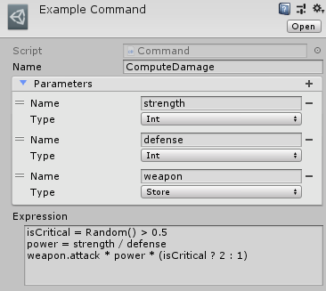

[#topics/variables-6]

## Writing Custom Commands

Calculations can be defined in a Command as a way to share expressions among different objects or keep complex calculations isolated from the places they are used. This can improve organization and make it easier to manage different pieces of game logic. Commands are created in the https://docs.unity3d.com/Manual/ProjectView.html[project window^] using the _Create_ menu and found under menu:PiRho Soft[Command]. A Command should always be placed in a _Resources_ folder so it can be https://docs.unity3d.com/Manual/LoadingResourcesatRuntime.html[loaded at runtime^] by the <<manual/composition-manager.html,CompositionManager>> (this will happen automatically).

A command consists of a _Name_, a list of input _Parameters_, and an _Expression_. _Name_ is the text to use in an expression to call the command. _Parameters_ contains the definitions for the input values the expression will use to perform the computation. _Expression_ defines the command with the final statement computing the result. Each of the parameters are available to the expression directly and variables can be created without reference any store. For example, the damage calculation from the <<topics/variables-4.html,previous section>> could be written as a command named `ComputeDamage` with parameters `strength`, `defense`, and `weapon`:

....
isCritical = Random() > 0.5
power = strength / defense
weapon.attack * power * (isCritical ? 2 : 1)
....

This command would then be called with `local.damage = ComputeDamage(global.player.strength, global.target.defense, global.player.weapon)`
